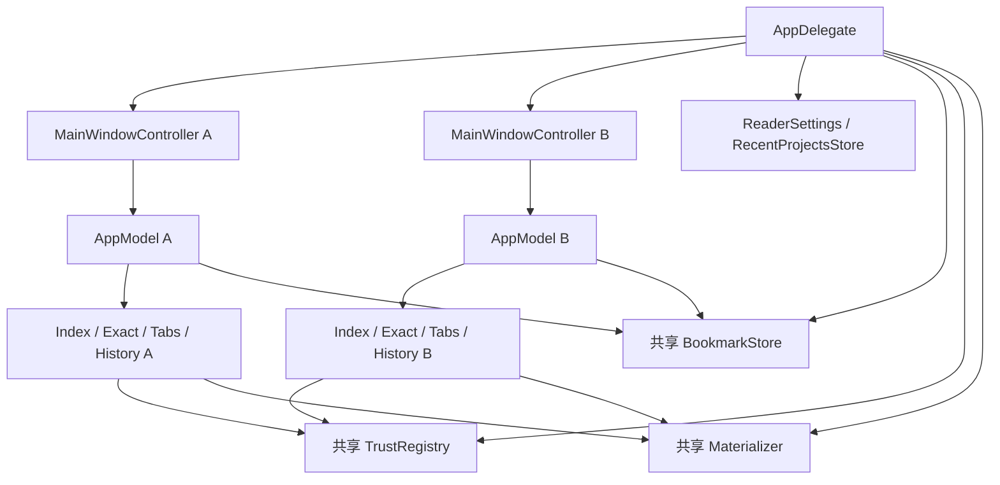

# Cairn 多窗口、多项目与目录打开设计

状态：已完成并通过最终验收（2026-09-18）。设计范围 W01–W20 全部闭环；最终 CI 978 项测试通过，fold-perf 253.86ms，按名称 open -a Cairn 和实际跨窗口交互验证通过。权威完成记录：[最终验收](../reviews/2026-09-18-multi-window-final-acceptance.md)。早期评审与修复记录保留为历史。

日期：2026-09-16。源码调研基线：`90c6526`。本文的“现状”来自源码检查，不代表已通过运行复现；“目标行为”是后续实现的约束。

## 1. 目标和决策

允许用户同时阅读多个项目，每个项目拥有独立窗口、标签、导航历史、索引和 Exact 分析会话。支持从终端执行 `open -a Cairn some_dir`，将目录打开到对应项目窗口。

采用单进程、多窗口：AppDelegate 持有多个 MainWindowController，每个控制器拥有独立 AppModel。沿用 AppKit、现有项目会话文件和索引入口。应用级数据由同一进程内的共享对象协调。

首版不引入 Workspace 类型、通用窗口管理框架、NSDocument 架构、数据库或 IPC 服务。项目身份使用规范化后的目录 URL；集合规模很小，线性查找窗口即可。

### 1.1 范围

包含：

- 多项目窗口，以及空白窗口的新建、复用和关闭。
- 菜单、快捷键、工具面板、信任确认与所属项目的准确路由。
- Launch Services 目录打开、冷启动与热启动处理。
- 关闭单窗和退出应用的会话保存、任务取消及 Exact 清理。
- 书签、信任、物化缓存的单进程多窗口安全。
- 打包后 `.app` 的真实入口验收。

不包含：

- 同一项目在两个独立窗口中同时编辑阅读状态。
- 一个窗口容纳多个项目，或者跨项目联合搜索、联合索引。
- 重启时恢复全部窗口及窗口排列。
- 新增终端 CLI、文件路径加行号协议、自定义 URL scheme。
- 多应用进程并发写入同一用户数据目录的支持。

最后一项与命令的区别：

```bash
open -a Cairn /path/to/project
open -a Cairn /path/to/project-a /path/to/project-b
open -n -a Cairn /path/to/project
```

前两条是本设计支持的打开方式。第三条的 `-n` 强制启动新进程，不在首版并发安全保证内，不能作为多窗口实现方式或验收捷径。独立进程需要额外的书签、信任、session 与缓存协调；不能把单进程的锁或 actor 宣称为跨进程保护。

## 2. 当前实现与改动理由

路径均相对于仓库根目录，符号名是定位依据，行号可能随实现变化。

| 位置 / 符号 | 当前实现 | 本设计调整 |
|---|---|---|
| `Sources/CodeInsightApp/CodeInsightApp.swift` / AppDelegate | 单个 `model`、`windowController` | 窗口集合和活动项目窗口 |
| 同上 / `launch` | 建立单窗，直接恢复最后项目 | 分离应用初始化、建窗、启动恢复 |
| 同上 / 菜单 action、`validateMenuItem` | 固定访问同一个 model/controller | 对相同的目标项目窗口执行和校验 |
| 同上 / `showSettings` | 设置窗口绑定第一次提供的 ExactCoordinator | 设置全局操作不再依赖某个项目 coordinator |
| `Sources/CodeInsightApp/MainWindowController.swift` | 各实例已有独立 reader、sidebar、model、面板 | 保留，补所属窗口路由及明确关闭入口 |
| 同上 / `windowWillClose` | 保存面板布局 | 补完整保存和资源收尾 |
| `Sources/CodeInsightAppModel/AppModel.swift` | 构造器默认创建独立索引服务和 ExactCoordinator | 每窗口继续独立，不共享可变项目模型 |
| 同上 / session 存储 | `sessions/<canonical-root-hash>.json` | 保留格式和目录 |
| 同上 / `sessionProjectPointer` | 每次成功 checkpoint 都更新最后项目指针 | 指针更新归 AppDelegate，避免后台保存抢占恢复目标 |
| `BookmarkModel.swift`、`BookmarkStore.swift` | 每模型缓存全表，再写同一 `bookmarks.json` | 共享记录和持久化状态，跳转状态仍独立 |
| `Sources/CodeInsightExact/TrustRegistry.swift` | 每实例加载一次、整表保存 | 应用内共享一个 registry |
| `Sources/CodeInsightExact/Materializer.swift` | 默认共用目录，实例级锁；只保护本次目录免于淘汰 | 共享实例，并保护全部准备中和使用中的目录 |
| `scripts/make-app.sh` | 未声明目录文档类型 | 生成目录类型声明 |

现有控制器的 Esc 事件监听已检查 `event.window === window`，toolbar identifier 也已按实例唯一；保留这些隔离机制。不要为本功能重新实现 Reader、索引或语言服务器。

## 3. 用户行为合同

### 3.1 打开和新建

| 操作与条件 | 结果 |
|---|---|
| 无参数启动，存在有效最后会话 | 恢复一个项目窗口 |
| 无参数启动，没有可恢复会话 | 显示一个欢迎窗口 |
| `⌘N` / File → New Window | 新建空白欢迎窗口，不自动恢复旧项目 |
| Open Project / Open Recent / 外部目录请求，目标项目未打开 | 优先复用合适的空白窗口，否则新建窗口 |
| 打开目标项目已经存在，正在加载也算 | 激活已有窗口，不重复索引或新建模型 |
| 请求已打开但最小化的项目 | 取消最小化并激活 |
| 请求已打开但处于失败状态的项目 | 激活其失败界面，由用户使用 Retry；重复命令不隐式重试 |
| 同一批传入多个不同目录 | 按输入顺序处理，每项目一窗，最后成功处理的窗口前置 |
| 同一批目录存在重复项或符号链接别名 | 去重，只处理第一次出现的项目 |
| 用户取消语言选择 | 取消该目录请求，继续处理后续目录 |
| 对已有项目调整语言 | 在该项目窗口中按现有保存后重载流程执行 |

“空白窗口”必须尚未认领项目、未处于打开/恢复/关闭过程中。窗口仍显示欢迎界面，不代表它尚未认领项目。

从窗口按钮或拖入操作触发时，优先使用该来源窗口（仅当其为空白）；外部请求优先使用活动空白窗口，再查找其他空白窗口。已有项目窗口绝不因为打开另一个项目而被替换。

打开当前项目内部的文件、标签或同项目书签仍在原窗口完成。本设计不扩展跨项目书签跳转；如现有书签入口遇到项目不匹配，继续保留现有反馈，不偷偷切换该窗口项目。

### 3.2 目录身份和校验

进入应用打开入口后执行：

1. 仅接受 `isFileURL` 的 URL。
2. 使用文件元数据确认目录存在且确为目录。普通文件、非文件 URL、失效符号链接和不可访问目录显示明确错误。
3. 使用 `resolvingSymlinksInPath().standardizedFileURL` 得到项目身份；与现有 session 的身份规则一致。
4. 不转小写，不按目录名去重，不把子目录自动提升到 Git 根目录；`repo` 与 `repo/subdir` 是两个明确请求。
5. 从身份查找已认领的窗口，并在任何异步加载前登记身份。

终端相对路径由 `open` 相对于调用方工作目录解释。应用不依赖自身 cwd，也不自己解析 shell 引号。包目录是否能作为项目应沿用现有项目目录验证规则，不为 `.app` 等包新增特殊浏览功能。

该规范化并非所有文件系统别名的通用身份机制；首版验收覆盖绝对/相对路径、尾斜杠、`.`、`..` 和符号链接，不另建 inode 身份系统。

### 3.3 语言选择

- 已有窗口优先：重复打开直接激活，不重新弹语言选择。
- 有有效项目会话时沿用保存的语言组合。
- 无会话但有 Recent 语言记录时沿用该组合。
- 首次打开复用现有有界语言探测和语言选择界面；不得因为外部打开走到单语言便利入口而无条件使用 Rust。
- 显式的 Open Python / Open TypeScript 保留其语言意图；若项目已打开且语言不同，先激活目标窗口，再确认或执行现有显式语言切换行为。
- 批量打开时选择界面串行显示。新建目标窗口后若取消选择，自动创建的空白窗口可关闭；用户先前创建的空白窗口应保留。

## 4. 对象归属



| 生命周期 | 持有内容 |
|---|---|
| 应用级 | 窗口集合、最近活动窗口、全局设置、最近项目、共享书签存储、信任 registry、物化缓存、设置窗口、启动期间待处理目录 |
| 项目窗口级 | AppModel、索引服务、ExactCoordinator、标签、导航、Trail、Compare、Reader、项目面板、恢复任务、认领的项目 URL |
| 工具面板级 | 所属项目窗口的弱引用，当前交互状态 |
| Exact session 级 | provider/session、generation、所占用物化目录的引用 |

项目窗口不能共享 AppModel、ProjectIndexService 或 ExactCoordinator。应用级共享对象通过现有构造器注入；生产建窗与测试建窗应复用同一装配路径，但测试可提供隔离存储。

### 4.1 最小接口方向

以下是职责约束，不是要求原样照抄的实现：

```swift
// AppDelegate：管理窗口，统一所有“打开项目”请求。
private var projectWindows: [MainWindowController] = []
private weak var lastActiveProjectWindow: MainWindowController?

// MainWindowController：加载开始前就认领项目，关闭完成后释放。
private(set) var projectURL: URL?

// AppModel：只清理自己拥有的项目任务，不清全局缓存。
func closeProject() async
```

窗口集合与路由在 MainActor 上。认领项目、记录窗口、启动异步任务的顺序必须保证重复请求不会穿透。关闭过程中的窗口仍认领项目；再次请求同项目应等待该窗口完成关闭后再打开，不能同时产生两个 session 写入者。

不需要额外的 WindowSession/Workspace 包装。准备或关闭状态可以保存在现有控制器上；如异步打开必须排队，使用小型目录队列，不引入通用事件总线。

## 5. Launch Services 与启动顺序

### 5.1 系统入口

实现 `NSApplicationDelegate.application(_:open:)` 处理 `[URL]`，覆盖终端 `open -a` 和 Finder 交给 Cairn 的目录。无需同时实现多个功能重复的 openFile/openFiles 入口。

这是系统发送的打开请求，不是 `--args` 参数解析。已有 self-test 启动参数和独立测试路径保持可用。

### 5.2 冷启动

AppKit 的文件打开回调可以早于 `applicationDidFinishLaunching`。因此不能继续在 didFinish 中无条件创建并恢复旧项目。

顺序：

1. `applicationWillFinishLaunching` 初始化菜单、共享存储、主题；不自动打开项目。
2. 启动尚未完成时收到的目录请求只登记到队列，并标记“收到显式打开请求”。
3. didFinish 中优先处理该队列；没有显式请求时才恢复最后项目或显示欢迎页。
4. 显式请求全部失败或取消时，确保存在欢迎窗口，不顺便恢复无关旧项目。
5. 启动完成后的请求立即交给同一打开队列；若正在显示语言选择，后续请求排队。

不使用固定延迟猜测系统事件是否已经送达。需要通过真实 `.app` 冷启动验证顺序；若目标系统确实出现后到请求，只允许复用尚未认领项目的欢迎窗口，不覆盖已有恢复工作。

### 5.3 打包声明

在 `scripts/make-app.sh` 生成的 Info.plist 中加入：

```xml
<key>CFBundleDocumentTypes</key>
<array>
    <dict>
        <key>CFBundleTypeName</key>
        <string>Project Folder</string>
        <key>CFBundleTypeRole</key>
        <string>Viewer</string>
        <key>LSItemContentTypes</key>
        <array><string>public.folder</string></array>
        <key>LSHandlerRank</key>
        <string>Alternate</string>
    </dict>
</array>
```

`Alternate` 声明辅助打开能力，不主动把 Cairn 注册成用户的文件夹默认打开应用。验收时确认命令命中的 bundle 路径和版本，避免旧安装包造成假阴性或假阳性。文档声明后必须重新打包、签名和检查 plist，不能只运行 SwiftPM executable 代替。

## 6. 活动窗口、菜单与面板

### 6.1 路由规则

统一目标解析供 action 和 `validateMenuItem` 使用：

1. key window 是项目主窗时，使用它。
2. key window 是项目所属的搜索、书签等工具面板或 sheet 时，使用其明确 owner。
3. key window 是全局 Settings/About 等应用窗口时，项目命令禁用；全局命令仍有效，不继续回退到 main window。
4. 其余情况下考察 AppKit main window 是否为仍有效的项目主窗。
5. 没有可用项目目标时，不默认选集合第一个，也不把最近活动窗口作为任何键盘输入的兜底。

最近活动项目窗口用于恢复目标与外部打开的空白窗口选择，不是全局设置窗口的隐式项目操作目标。面板 owner 用弱引用或已有控制器关系表达；关闭主窗口必须关闭其面板。

保留 AppDelegate 的菜单 action 转发方式，集中修正目标解析即可，不必同时迁移全部 selector 到 responder chain。工具栏和 Reader 内部回调继续绑定所属控制器。

### 6.2 异步操作

打开确认框、语言选择框或提交异步操作时就捕获目标控制器、项目身份及必要 generation。用户切换窗口后，回调仍只作用于原目标；目标已关闭或 generation 变化则丢弃结果。

信任确认尤其不能在用户点击确认之后重新读取“当前活动 model”。错误提示显示在发起操作的窗口；若它已关闭，不把旧错误贴到另一个项目上。

当前 AppDelegate 的 `mixedLanguageCheckboxes`、`mixedLanguageOpenButton` 属于全局可变对话框状态；实施时改为一次对话框调用的局部状态或由该对话框持有。即使外部打开已排队，也不能让其他窗口的语言调整覆盖正在显示的选择内容。

### 6.3 菜单和关闭快捷键

- File → New Window：`⌘N`。
- 保留现有 `⌘W` 关闭活动标签行为；无标签时关闭项目窗口。
- File → Close Window：`⇧⌘W`，以及系统红色关闭按钮。
- 搜索输入、书签备注等编辑控件保持正常文本快捷键；不得由全局转发抢走其输入。
- 增加系统 Window 菜单并设置 `NSApplication.windowsMenu`，支持窗口切换、最小化和 Bring All to Front。
- 设置有意义的 `NSWindow.title`，例如 `project-name — Cairn`；同名项目使用父路径辅助区分，完整路径可通过标题辅助信息表达。

### 6.4 设置与布局

字体、主题等 ReaderSettings 仍为全局偏好，修改后广播给所有项目窗口。Settings 保持单实例，但信任列表直接读取共享 registry，清理缓存直接调用应用级协调入口；不能永久保留某个已关闭窗口的 ExactCoordinator。

首版保留现有全局布局偏好作为新窗口默认值，各窗口运行时布局独立。不会实时把 A 的分隔条位置同步给 B。全局默认值可由最近一次保存覆盖，这与项目会话隔离是不同问题。

窗口 frame autosave 应避免所有窗口争用 `CodeInsightMainWindow`：项目窗口采用现有项目哈希派生的名字，空白窗口使用独立默认策略。新建窗口采用 AppKit cascade 并限制在可用屏幕区域。项目恢复全部窗口的位置不在范围内。

## 7. 关闭、退出和会话保存

### 7.1 单个窗口关闭

必须显式收尾，不能依赖 deinit 或应用退出间接完成：

1. 标记关闭中，拒绝新的项目操作；取消该窗口的打开/恢复任务，阻止迟到结果安装。
2. 结束书签备注编辑；采集 Reader 的当前标签、selection、scroll 和布局，立即 checkpoint。
3. 保留现有恢复期间的保存抑制规则，不能把未恢复完整的空标签集合覆盖到原会话文件。
4. 取消 model 的 snapshot、compare、replay、semantic validation、自动 checkpoint、bookmark jump、Context/Relations 等所属任务，推进 generation/epoch。
5. 关闭窗口所属面板、监听器和回调连接。
6. 停止该窗口的 Exact 请求，等待正在退出的 provider 和 prepare 工作达到可释放状态，再释放物化目录引用。
7. 从应用窗口集合删除控制器，释放项目认领。任何迟到回调均不能复活窗口或再次写 checkpoint。

窗口可先从界面消失，但 controller 在收尾完成前由应用保留。清理方法必须幂等，重复关闭和退出不能重复保存不同状态或重复释放缓存引用。

允许取消关闭的保存检查须在 `windowShouldClose` 等关闭批准阶段执行，不能等到 `windowWillClose` 才询问用户。批准之前不得不可逆地销毁 model；对加载/恢复的暂停或取消要保留可重试状态。关闭失败提示取消后，已经 ready 的阅读状态应继续可用，未完成的加载可明确重试。`windowWillClose` 只执行已批准的收尾。

现有 Exact `shutdown()` 的同步签名不等于全部后台任务已经结束：prepare 包含 detached 工作，取消外层 task 不会自动等待它。需提供可等待的幂等关闭路径，保留 prepare/旧 session close 的完成句柄；过期的 prepare 产物也要主动关闭，不能仅用 epoch 检查拒绝安装后遗留子进程。不得通过提前清空 task 引用丢失等待能力。

会话写入失败时保留原文件；正常运行中沿用 sessionSaveNotice。关闭时若最终保存失败，提供重试、取消关闭、继续关闭的选择，不能静默宣称“已保存”。书签 dirty 的失败也不能因销毁窗口而丢掉其应用级内存副本。

### 7.2 应用退出

`applicationWillTerminate` 不适合启动一组需要等待的新异步清理。使用 `applicationShouldTerminate` 协调：

- 阻止新项目打开，先对全部窗口完成最终采集/保存。
- 某窗口保存失败时允许用户取消退出或明确继续；取消时恢复交互，不提前销毁其他窗口。
- 需要异步等待时返回 `.terminateLater`，收尾结束后调用 `reply(toApplicationShouldTerminate:)`。
- 复用现有 provider 的退出超时和终止机制，不在主线程无限等待；超时应记录并处理，不冒充正常关闭。
- WillTerminate 仅保留幂等的最终兜底，不再次依赖已释放的单窗 model。

保持当前“关闭最后窗口后退出”的产品习惯。全局设置窗口存在时不要误判为还有项目；以项目窗口集合决定是否发起终止，并走同一退出路径。若因保存错误取消终止，恢复或保留相关项目窗口。

### 7.3 最后项目恢复指针

不同项目会话继续独立保存，后台 checkpoint 不再更新全局最后项目指针。

AppDelegate 记录最近活动且已成功持久化的项目。活动项目首次保存成功时才有资格成为恢复目标；失败或仍在恢复中的项目不能用空快照替换有效目标。退出前按最近活动次序选择成功保存的项目，不能按窗口集合遍历顺序决定。

关闭最后项目窗口时，成功保存的该项目可保留为下次恢复目标。清空 Recent 列表继续不清除此指针。已有 `LastSessionProject` key 和 session JSON 无需改变；移除 AppModel 对该全局指针的隐式写入，并相应更新旧注释与测试。

## 8. 共享持久化与 Exact 缓存

### 8.1 书签：共享内容，独立跳转

仅给 `BookmarkStore.replace` 加锁无效：A、B 可分别从旧缓存生成不同全表，然后串行覆盖彼此。仅在面板出现时 reload 也不能保证保存失败时的 dirty 内容不丢失。

首选在现有 BookmarkStore 上收拢单进程唯一的记录与持久化状态：将它调整为 MainActor 下共享引用对象，持有 records、storageError、rescueBytes、isDirty；保留现有 JSON 格式、记录上限、校验和原子写入逻辑。

BookmarkModel 保留每窗口的 workspaceGeneration、attemptGeneration、jump task 和提示。记录读取转向共享 store，增删改从共享的最新 records 计算，并在同一个 MainActor 操作中提交；这些读改写之间不得 `await`。不共享整个 BookmarkModel。

具体行为：

- A 新增书签后，B 的列表和 gutter 通过 Observation 或已有观察回调刷新。
- B 修改另一个书签时，必须保留 A 的更新。
- 写盘失败继续遵循现有“保留内存 candidate、标记 dirty”语义，但 dirty 状态属于共享存储；下一次保存基于这个最新内存表，不能 reload 旧磁盘覆盖它。
- 损坏文件的 rescueBytes 和禁止覆盖规则继续保留，不因窗口增加而放宽。
- 延迟提交的备注按 bookmark ID 更新当前记录；记录已删除时不复活，同一记录的多个备注修改按主线程提交顺序处理。
- 现有全局 32 条限制仍为全应用限制，不悄悄变成每窗口 32 条。
- 单元测试提供内存或临时目录 store，禁止依赖全局 singleton。

这是现有存储职责的调整，不新增通用 Repository/事务框架。若实施时选择保留底层 codec 为值类型，可将纯编码逻辑保留在现有文件内，但不能再次产生多份权威 records。

### 8.2 信任

AppDelegate 创建一个 TrustRegistry，注入所有窗口的 ExactCoordinator。共享 actor 保证各次 grant/revoke 基于同一状态；持久化失败不得只更新内存却向用户报告已生效。

授予信任只针对确认时捕获的项目。撤销信任由应用级入口完成：

1. 阻止受影响项目继续启动 trusted prepare，取消正在准备的 trusted 任务。
2. 停止受影响的活跃 trusted session，等待其终止。
3. 将撤销写入 registry，刷新所有窗口和 Settings 的列表及状态。
4. 持久化失败时显示错误，保持已停止会话，不自动恢复 trusted 执行；用户需明确重试。
5. 后续分析按 Safe 模式重新准备，继续遵循现有信任边界。

registry 的写入与重启路径需串行协调，避免 await 期间重新启动已撤销的权限。不得只更新 UI 列表而让旧 trusted provider 继续运行。

### 8.3 物化缓存

应用内注入一个 Materializer，继续使用已有锁串行化目录创建、发布与删除。除此以外增加“目录正在使用”的引用计数，键为规范化缓存目录 URL。

必须满足：

- 获取已存在或新建目录与增加引用在同一个锁范围内完成，不能先返回 URL 再异步登记使用。
- 准备中的 provider 已经算占用；prepare 失败、取消、epoch 过期都要释放。
- 活跃 session 持有引用，直到 provider 确实退出后才释放；切换 revision 时，新旧 session 的引用可以短暂同时存在。
- 多窗口复用相同目录时按引用计数，而非简单 Set，避免一个窗口关闭就解除另一个窗口的保护。
- quota 仅淘汰引用计数为零的目录。活跃目录总量超过当前配额时暂时超过软上限，不删除正在使用的数据；引用释放后允许再回收。
- 不改变现有 commit/config 缓存键和磁盘格式，除非实施验证发现独立的键冲突问题。

获取/释放可扩展现有 Materializer API，由 ExactCoordinator 的已有 active/prepare 生命周期持有目录引用。无需为缓存创建后台服务；如必须封装引用的释放，类型仅表示这个真实资源生命周期，不扩展成通用 lease 框架。

### 8.4 用户清空缓存

Settings 的“清空物化缓存”是应用级操作：明确提示会停止所有项目的 Exact 分析，然后短暂禁止新的 prepare，等待所有相关 prepare/provider 停止及目录引用释放，再删除缓存。

删除失败时展示错误并退出维护状态；任一步未能安全停止，禁止强行删除仍被引用的目录。恢复 prepare 入口后，各项目显示 Safe/待分析或可重试状态，按现有按需机制重新准备。Reader、索引、标签和会话不应被清空。

单窗口关闭只释放其资源，绝不能调用清空全局缓存。

## 9. 失败、兼容与资源边界

| 场景 | 合同 |
|---|---|
| 一批 URL 中某项无效 | 报告具体路径及原因，继续处理其他目录 |
| 项目索引失败 | 保留对应窗口的失败页；其他项目不受影响 |
| 开始加载后用户关闭窗口 | 取消、失效化回调，不能稍后重新显示或落盘半成品 |
| 语言选择期间重复请求 | 同项目不重复提示，其他项目排队 |
| 保存会话失败 | 保留旧文件；关闭/退出时有明确处理选择 |
| 书签写盘失败 | 全应用保留最新 dirty 表，不接受旧窗口整表覆盖 |
| Exact 退出超时 | 遵循现有终止机制；未确认退出前不释放占用目录供删除 |
| 旧 session / 旧书签 | 复用已有迁移与校验，不新增 schema 版本 |
| 显示器变化 | 窗口落在可见区域，保留现有最小尺寸与自适应约束 |

每项目独立索引和语言服务器会增加内存、CPU 和子进程数量。首版不设无依据的窗口数量上限，不实现跨项目索引共享。验收记录两个代表性项目的资源及关闭后回收情况；后续只有测得瓶颈才增加调度策略。

## 10. 实施分步与文件范围

所有步骤完成前，本功能仍为未完成；不能把“看见两个窗口”视为可发布。

### S1：窗口集合与项目路由

- 修改 AppDelegate 的单窗持有方式，抽出建窗装配入口。
- 每窗口独立 AppModel，统一菜单/Recent/拖入目录打开路径。
- 实现项目认领、同项目去重、空白复用、标题和系统 Window 菜单。
- 完成活动窗口和工具面板 owner 路由；捕获异步操作目标。
- 范围以 `CodeInsightApp.swift`、`MainWindowController.swift` 和相关面板为主。
- 门槛：双窗导航、菜单状态和快捷键正确；未完成 S3 前不得以用户真实存储进行并发写入验收。

### S2：关闭与恢复生命周期

- 在 AppModel 增加明确的项目清理入口，复用已有取消与 generation 机制。
- 控制器持有并取消项目打开/恢复任务；补所有退出路径。
- 将最后项目指针更新从 model checkpoint 移到应用层。
- 处理最后窗口、Settings 存在时的退出和保存失败。
- 范围涉及 AppModel、MainWindowController、AppDelegate、RecentProjectsStore 及必要 Exact 生命周期接口。

### S3：共享数据与缓存安全

- BookmarkStore 共享记录/保存状态，BookmarkModel 保留窗口跳转状态。
- 共享 TrustRegistry，应用级撤销信任流程。
- 共享 Materializer，引用计数保护和应用级 clear 流程。
- ReaderSettingsWindowController 不再绑定首个项目 coordinator。
- 门槛：交错书签写入、dirty 重试、缓存占用与释放、撤销信任均有行为测试。

### S4：系统打开与打包

- 加入 `application(_:open:)` 和冷启动队列。
- 调整 Info.plist 生成与启动恢复策略。
- 验证多个目录、空格/中文路径、已有窗口、同项目别名和错误路径。

### S5：集成与真实应用验收

- 跑相关测试和仓库要求的 `scripts/ci.sh`；检查已有 self-test 对单窗 delegate/model 的假设并保持它们的覆盖意义。
- 打包、验证 plist/签名，确认正在运行的 bundle 为本次产物。
- 完成下节验收并写独立验收记录；实现后才更新本文状态及产品说明。

S1/S2 与 S3 可在明确文件责任后并行开发，但 AppDelegate 装配、Settings 和 Exact 生命周期接口需先协调，避免同时覆盖。S4 依赖稳定的项目打开入口，S5 依赖全部前置步骤。

## 11. 验收矩阵

沿用仓库现有测试设施，不另建测试框架。自动化只覆盖可失败的行为与生命周期，不为简单属性转发逐个写镜像测试。

| ID | 验收场景 | 必须证明 | 证据层级 |
|---|---|---|---|
| W01 | 打开 A、B 项目 | 两窗两模型，各自 root/tabs/history/index 独立 | model + AppKit |
| W02 | A、A 的符号链接、加载中的 A 连续打开 | 一窗、一次有效加载，没有重复选择框 | 路由 + AppKit |
| W03 | 焦点在 A/B 交替使用查找、后退、关系、关闭标签 | 只修改目标窗口，菜单 enabled 与目标一致 | 真实 AppKit |
| W04 | B 的搜索或书签面板成为 key window | 仍指向 B，输入快捷键不被抢走 | 真实 AppKit |
| W05 | A 的确认框打开后切换 B | 确认只影响 A；A 已关则不执行 | AppKit + 异步测试 |
| W06 | 关闭 A，B 保持运行 | A 最终保存，任务/provider 退出，B 继续工作 | 生命周期 + 进程证据 |
| W07 | 恢复/索引/Exact prepare 中关闭 A | 没有迟到安装、复活窗口、半成品覆盖或缓存引用泄漏 | 可控异步测试 |
| W08 | A/B 均有阅读状态，退出再启动 | 文件分别保存；按最后活动且成功保存项目恢复一窗 | 两次应用启动 |
| W09 | 最后项目关闭，Settings 仍开着 | 按合同进入正常退出流程 | 真实 AppKit |
| W10 | A/B 交错新增、修改、删除书签 | 不丢更新、UI 更新、全局上限一致 | 存储 + UI |
| W11 | 书签写入失败后另一窗继续修改再重试 | dirty 数据不丢，磁盘最终包含两窗更新 | 故障注入 |
| W12 | 多项目 grant/revoke 与 prepare 交错 | 信任不丢，撤销后旧 trusted provider 已停止 | registry + coordinator |
| W13 | 两窗共用同一物化目录，一窗关闭 | 另一窗引用继续受保护 | Materializer + coordinator |
| W14 | 不同快照超出小配额 | 只回收未占用目录；prepare 失败/取消也释放引用 | 小配额测试 |
| W15 | 清空缓存时两窗正在准备或分析 | 先停止并释放，再删除；Reader 会话不受损 | 集成 |
| W16 | 应用未运行，`open -a Cairn A` | 只打开 A，不附带上次项目或多余欢迎窗 | 打包 app |
| W17 | 应用已运行 A，`open -a Cairn B` | 同 PID 新窗口 B，A 保持原状态 | 打包 app |
| W18 | 一次命令打开多个目录 | 每目录一窗，重复去重，一项失败不影响其余 | 打包 app |
| W19 | 空格、中文、相对路径和无效目录 | 正确解释合法路径，明确报告错误 | 打包 app |
| W20 | 保存失败时关闭/退出后取消 | 不丢旧磁盘文件，窗口仍可操作，允许重试 | 故障注入 + AppKit |

运行真实验收时使用两个受控项目、隔离的用户数据与测试 bundle ID。先用明确的 `.app` 路径验证产物，再验证 `-a Cairn` 的按名称查找确实命中同一产物：

```bash
open -a /absolute/path/to/Cairn.app /absolute/path/to/project-a
open -a /absolute/path/to/Cairn.app /absolute/path/to/project-b
open -a Cairn /absolute/path/to/project-a /absolute/path/to/project-b
```

记录 bundle 路径、构建版本、PID、窗口标题/项目路径、操作结果及失败信息。单进程窗口数不能只通过 PID 判断；标题截图也不能证明模型隔离或后台资源退出。需要将 UI、持久化和进程证据分别记录。

验收状态使用 PASS / FAIL / BLOCKED / SKIP。未运行真实 Launch Services 入口或未验证共享数据安全时，不得标为完整通过。

## 12. 备选方案与取舍

| 方案 | 不采用原因 / 后续采用条件 |
|---|---|
| 每项目 `open -n` 新进程 | 隔离 UI 简单，但全局文件和缓存仍共享，还增加进程间一致性问题 |
| NSDocument / NSDocumentController 重构 | Cairn 阅读的是目录项目，已有控制器和 session；本需求无需承担完整 document 架构迁移 |
| SwiftUI WindowGroup 重写 | 与当前 AppKit UI 不匹配，无助于解决共享存储与关闭清理 |
| 一套共享 AppModel，多窗口展示 | 标签、导航、索引和 Exact 会串项目，违背目标 |
| 每窗口复制所有存储文件 | 破坏全局书签/信任一致性，需要额外合并与迁移 |
| 重启恢复全部窗口 | 需要持久化窗口列表、顺序和失败恢复策略，待有明确需求再做 |
| 新增通用窗口/资源管理框架 | 现有 AppDelegate、controller、store 和 coordinator 已能承载具体职责 |

## 13. 参考依据

- 本机 `man open`：`-a` 指定应用，`-n` 强制新实例，`--args` 才向 main 传参；文件参数相对于调用 shell 的当前目录解释。
- [Apple：application(_:open:)](https://developer.apple.com/documentation/appkit/nsapplicationdelegate/application(_:open:))：通过 delegate 处理 URL，支持没有对应 NSDocument 的资源。
- [Apple：applicationDidFinishLaunching(_:)](https://developer.apple.com/documentation/appkit/nsapplicationdelegate/applicationdidfinishlaunching(_:))：文件打开与启动初始化的先后关系。
- [Apple：CFBundleDocumentTypes / Core Foundation Keys](https://developer.apple.com/library/archive/documentation/General/Reference/InfoPlistKeyReference/Articles/CoreFoundationKeys.html)：文档类型、角色、UTI 和 handler rank。
- [现有阅读会话设计](2026-09-15-reading-session-restore-plan.md)：按项目保存、恢复抑制和迁移规则。本设计只调整多窗口生命周期与最后项目指针归属，不撤销已有数据保护要求。
