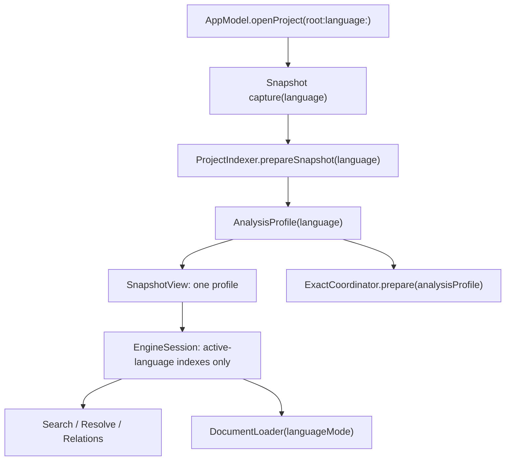

# M12 实施计划 v1：多语言架构地基（单语言项目）

> 状态：已批准（2026-08-11）；本文件只定义实施顺序、边界和验收，不包含产品代码。
>
> 草拟时仓库基线：`a83f55fd264cec1a0d25dc14c697bb003738cb62`（`main` 与
> `origin/main` 同步，工作区干净）。实施前必须把批准后的计划提交记为
> `M12_BASE`；若基线或受保护范围未确认，第一片直接 `BLOCKED`，不开始改代码。

---

## §0 结论先行

M12 可行，而且不需要先建一套“语言插件框架”。本里程碑采用最小架构：

1. 打开项目时显式选择一个 `LanguageID`；当前产品入口仍默认 `.rust`。
2. 语言值沿现有 `AppModel → Snapshot/Indexer → AnalysisProfile → EngineSession`
   链传递，不用隐式扩展名猜测覆盖调用方选择。
3. `AppModel` 用一个 private 同步 switch 决定“整条产品链是否已支持”；Engine、Reader、Exact
   各自现有模块再保留本层防御 switch。M12 只有 Rust 分支，Python/TypeScript 返回明确的
   unsupported，不产生半成品状态。
4. 复用 `LanguageID`、`LanguageMode`、`LanguageExtractor`、`AnalysisProfile`、
   `ContentIndexKey`、`SnapshotView` 和 `EngineSession`；不新增顶层 `LanguageAdapter`、
   registry、plugin、capability map 或“未来混合项目”容器。
5. 先证明 Rust 行为等价，再按完整 vertical slice 分别实现 Python 和 TypeScript；
   混合项目放到二者单语言支持都稳定之后。

M12 的产品结果不是“Python/TypeScript 已可用”，而是：Rust 产品行为不变，所有语言相关
身份都已显式且可隔离，下一门语言只需补现有 switch 的一个完整分支，不需再次横切重构。

---

## §1 事实基线

### §1.1 已有通用模型，不需要再造一套

- `Sources/CodeInsightCore/ContentIndex.swift`
  - `LanguageID` 已有 `.rust`、`.python`、`.typescript`、`.javascript`。
  - `LanguageMode` 已进入 `ContentIndexKey`。
  - `ContentIndexKey` 已同时包含 content、language mode、grammar version、extractor version。
  - `LanguageExtractor` 已是可复用的提取 seam。
- `Sources/CodeInsightCore/QueryContext.swift`
  - `AnalysisProfile` / `AnalysisProfileID` 已包含语言身份。
- `Sources/CodeInsightEngine/ProjectIndexStore.swift`
  - `SnapshotView` 当前只有一个 `AnalysisProfile` 和一份 `ModuleMap`，天然符合本期
    “一个项目打开态只有一门活动语言”的约束。
- `Sources/CodeInsightExact/ExactProvider.swift`
  - `ExactProvider` / `ExactSession` 已是 provider-neutral；无需先抽一套通用 LSP runtime。
- `docs/design.md` 已冻结 3+1 层：`ContentIndex` 按完整 language mode，manifest 只记录
  `detectedLanguage`，项目配置进入 `AnalysisProfile`，Scope Builder 每语言独立实现。
- `docs/plans/m5-plan.md` 已把当前 `AnalysisProfile` 的 unit/config/environment framing 定义为
  TS/Python 复制的跨语言合同；M12 不另建第二套 profile 模型。

### §1.2 Rust 假设仍散落在真实调用链

当前关键路径不是只缺一个 extractor：

```text
AppModel.openProject(root:)
  → IndexService / ProjectIndexer
    → WorktreeSnapshot 只捕获 .rs
    → ProjectIndexer.detectLanguage / rustContentKey
    → RustExtractor.extractWithDiagnostics
    → ProfileDetector(Cargo)
    → SnapshotView(单 profile + Rust ModuleMap)
  → EngineSession
    → Reader DocumentLoader → RustHighlighter
    → ExactCoordinator → Cargo ExactProfileKey → RustAnalyzerProvider
```

具体硬编码位置包括：

- `WorktreeSnapshot` 的文件捕获规则；
- `ProjectIndexer` 的 `.rs` 识别、Rust key 和直接 `RustExtractor` 调用；
- `EngineSession` 只按 `contentID + detectedLanguage` 选 key，未用完整 `LanguageMode`
  和 profile language 封闭活动视图；
- `SnapshotSearch`、coverage、文件树和若干 Reader/Relation/CLI 调用方再次写 `.rust`
  或自行找 content index；
- `DocumentLoader`、`DiffCore` 直接构造 Rust 语法路径；
- `ExactCoordinator` 重新读取 Cargo 信息，provider factory 也固定 rust-analyzer；
- Exact overlay reuse 与 sandbox 环境没有完整语言/profile 身份。

因此只加 Python/TypeScript parser 会得到“能解析、不能正确浏览/搜索/Reader/Exact”的
零散支持，违背既有“整语言 vertical slice”决策。

### §1.3 两个必须先修的身份问题

1. `LanguageMode.variant` 当前是 `StringID?`。`StringID` 是 interner 内部编号，不是跨进程、
   跨构建稳定的缓存身份；未来 TS/TSX 一进入 cache key 就可能串键。
2. `IndexCache` 已在每个 entry key 中保存语言/模式/grammar/extractor 版本，同时数据库 metadata
   仍把 grammar/extractor 当作全库版本。后者会导致新增一门语言时无谓重建整个数据库。

这两项属于 M12 必要重构，不等到 Python/TypeScript 实现时再补。

### §1.4 当前验收状态的使用方式

- `docs/plans/evidence/m11/m11-acceptance.md` 记录了最近一次 M11 各片通过证据；这是历史证据，
  不冒充 M12 开工时的实时基线。
- M12 的 F0 必须在实际实现基线上重新运行完整测试/CI，并保存退出码和输出摘要。
- `CanonicalDump`、gold fixtures、`Prototypes/` 和既有 M11 evidence 均视为受保护路径；
  除非某个后续语言 slice 的批准合同明确要求，否则不得修改。

---

## §2 成功合同

M12 只有同时满足以下条件才算完成：

### §2.1 单语言项目合同

- 每个非 `.empty` project state 恰好有一个 `projectLanguage`；`.indexing`、`.failed`、`.ready`
  都保留它，`.empty` 为 nil。打开另一个已支持项目时与 `projectRoot` 一起覆盖。
- 生产调用使用 `openProject(root:language:)`；现有 `openProject(root:)` 作为 Rust 兼容入口，
  只委托 `.rust`，不做自动探测。
- snapshot 切换（worktree → commit → worktree）继承活动语言，但每个 snapshot 重新生成自己的
  `AnalysisProfile`；旧 profile 不跨 snapshot 偷复用。
- 会话保存显式写入 project language；旧的无 language 会话记录只迁移为 `.rust`。恢复时先恢复
  语言，再打开项目和回放 tab/anchor，不允许先按 Rust 加载文档。
- `PreparedSnapshot` / `SnapshotView` 携带并验证同一个语言身份；不允许
  `requestedLanguage != analysisProfile.language`。
- 一个 `EngineSession` 只暴露该 profile 对应的 `ContentIndex`、postings、alias、impl、imports
  和 relations；同名的其他语言 declaration 不能进入候选集。

### §2.2 Rust 零行为回归合同

- Rust worktree/commit 的 manifest、索引、模块解析、搜索、Reader、diff、history、Exact、
  trust/offline 行为保持等价。
- 既有不带 language 的 package/public 便利入口若被测试或外部 target 使用，继续按 Rust 工作；
  产品内部主调用链迁移到显式入口。
- Rust 的 `ContentIndexKey` canonical identity 在迁移后有确定的 golden assertion。
- cache schema 迁移允许丢弃旧的可重建 cache，但不能误读旧 entry 或静默复用错误语言 entry。

### §2.3 失败诚实合同

- M12 中请求 `.python`、`.typescript` 或 `.javascript` 时，在改变 `AppModel` 当前 project state、
  写入 cache、启动 Exact 子进程之前返回具名 unsupported error。
- 复用 `CocoaError(.featureUnsupported)` 并在 failure reason 写明语言；不为这一条路径新增 error enum。
- 显式入口同步 throws；测试同时断言 error code/reason、`projectState`、`projectRoot` 和
  `projectLanguage` 均未变化。
- 不展示空文件树、空 Reader 或“Exact unavailable”来伪装语言已支持。
- 不按文件数量或 root marker 静默猜语言；自动检测/选择 UI 留给第一门新语言的产品 slice。

### §2.4 下一门语言的扩展合同

完成 M12 后，增加 Python 或 TypeScript 单语言 **App 产品路径**支持时：

- 不再修改 `EngineSession` 的语言隔离模型；
- 不再修改 `AppModel` 的语言传递形状；
- 不再修改 cache key/schema 设计；
- 只在已有的 capture/index/profile/module、Reader/diff、Exact 三处 switch 增加完整分支，
  并增加该语言的真实实现和验收；全部通过后，最后在 AppModel 产品支持 preflight 中开放该 case。

若实际实现第二门语言时仍需再造顶层语言容器，说明 M12 seam 不合格，应先复审而不是继续叠层。
现有 `codeinsight` CLI 的命令、文案、parse 和 `exact-def` 明确是 Rust-only 诊断工具，本合同不把它
伪装成多语言入口；是否扩展 CLI 另立产品切片。

---

## §3 范围与明确不做

### §3.1 M12 范围

- 稳定 `LanguageMode` / `ContentIndexKey` / cache identity；
- 显式传播一个活动 `LanguageID`；
- 让 snapshot 捕获和 indexer 以调用方选择的语言工作；
- 让 `EngineSession` 建立封闭的单语言 view；
- 让 Reader/diff 和 Exact 接受显式语言/profile；
- 保留 Rust 兼容入口并证明 Rust 行为等价；
- 为未实现语言提供原子、可测试的 unsupported 路径。

### §3.2 M12 明确不做

- 不实现 Python/TypeScript parser、highlighter、module resolver、Pyright 或 TypeScript LSP。
- 不新增 Python/TypeScript `DeclarationKind` 占位 case；实际 extractor 需要时再追加。
- 不做语言选择 UI、root marker 自动探测、混合 marker 仲裁。
- 不做混合项目、多个 `AnalysisProfile`、多个 `EngineSession`、文件到 profile router。
- 不做动态 registry、插件发现、capability negotiation、运行时 adapter 组合。
- 不新增 `LanguageAdapter`、`ActiveLanguageModule`、`EngineLanguageAdapter`、
  `ReaderLanguageAdapter`、`ExactLanguageAdapter` 等只有 Rust 一个实现的 protocol。
- 不把现有 `ModuleMap` 抽成 protocol；第二门语言确实需要不同解析行为时，基于两个真实实现再抽。
- 不把 rust-analyzer transport 抽成通用 LSP session；等 Pyright/TypeScript provider 的真实差异可见后再裁决。
- 不扩大 WorktreeSnapshot 到“捕获所有文件”；仍只捕获活动语言及该语言 profile 必需的配置文件。
- 不顺带实现 JavaScript；已有 enum case 不构成产品承诺。
- 不把 Rust-only `codeinsight` CLI 改造成多语言 CLI；因内部 API 编译变化需要的调用继续走
  明确 Rust convenience，并列入结构审计 allow-list。
- 不重命名 Rust-specific 类型来制造“看起来通用”的表面统一。

---

## §4 架构裁决

### §4.1 三种方案比较

| 方案 | 形状 | 优点 | 代价 | 裁决 |
|---|---|---|---|---|
| A. 显式标量 + 现有模块内 switch | 传递 `LanguageID` / `AnalysisProfile`，在 capture/index、Reader、Exact 各有一个穷举分支 | 新实体最少；调用链可追；第二门语言会直接检验 seam | 有少量重复 switch | **采用** |
| B. 顶层 cohesive language module | 新建一个 module，把 index/Reader/Exact 都包起来 | 构造后调用方短；组合不易错 | 一个实现就引入总线类型；跨层依赖集中；容易演变成 service locator | 拒绝；出现两个真实语言实现且重复编排显著时再评估 |
| C. adapter bag / registry | extractor、resolver、Reader、Exact 分别注册/组合 | 最灵活 | 可组合出非法混搭；配置面和测试矩阵暴涨；混合项目需求尚未出现 | 拒绝 |

选择 A 不是把 `switch` 散到每个查询：语言分支只允许出现在五个现有所有权边界：

1. AppModel 同步产品支持 preflight（只有完整 vertical slice 才开放）；
2. snapshot capture / indexing / profile；
3. session construction / module resolution；
4. Reader / diff syntax construction；
5. Exact provider construction。

进入 `EngineSession` 后，查询只看已经封闭的 active view，不再逐次判断语言。

### §4.2 所有权与数据流



所有权规则：

| 身份/行为 | 唯一所有者 | 禁止 |
|---|---|---|
| 整条 App 产品链是否已支持 | `AppModel` private 同步 switch | 等进入 indexing 后才从异步服务得知 unsupported |
| 项目打开时的活动语言 | `AppModel` 当前 project state | 子模块重新猜测 root 语言 |
| snapshot 的分析语言 | `PreparedSnapshot.analysisProfile.language` | 从某个文件扩展名反推整个项目语言 |
| 文件的完整 mode | `LanguageMode` 的单一 path classifier | 文件树、Reader、Indexer 各写一套扩展名表 |
| index cache 身份 | `ContentIndexKey` | DB metadata 用单一 grammar/extractor 代表所有语言 |
| 查询可见集合 | `EngineSession` 构造期 active view | 每个 resolver/search 调用临时过滤 |
| Exact provider 选择 | `ExactCoordinator` 构造 provider 的 switch | UI、Reader 或 Engine 启动 provider |

### §4.3 `LanguageMode`：复用现有类型，修稳定性

将 `LanguageMode.variant` 从 `StringID?` 改为稳定的 `String?`：

```swift
public struct LanguageMode: Codable, Hashable, Sendable {
    public let language: LanguageID
    public let variant: String?
}
```

约束：

- 给现有 `LanguageID: UInt8` case 写出固定 raw value，并用固定向量测试锁定；以后新增 case 只能追加，
  不得因重排改变持久 cache identity。
- variant 只表示会改变 grammar/extractor 结果的语法模式；M12 Rust 仍为 nil。
- variant 写入时做 Unicode NFC 规范化；cache framing 必须用显式 nil/value tag + UTF-8 长度，
  不能把任意字符串直接拼进冒号分隔 key，避免 nil/空串或包含分隔符时碰撞。
- 不预先定义 `LanguageVariant` enum；TSX、`.pyi` 等真实分支进入时再添加已证实的字符串值。
- 在 `LanguageMode` 上增加一个现有类型的静态 path classifier；M12 只实现当前被支持的 `.rs`
  映射，并让未来 slice 在同一 switch 中增加扩展名。不要新增 `FileLanguageDetector` 类型。
- 所有调用方只调用这一处 classifier；未知路径返回 nil。

`StringID` 仍用于 `ContentIndex` 内部 interned 字符串，不再承担持久 cache identity。

### §4.4 cache：entry 自描述，全库 metadata 只管 schema

- `IndexCache` schema version 升级；metadata 只保留 cache schema version。
- grammar/extractor version 继续只属于 `ContentIndexKey`，因此 Rust 与未来 Python/TS entry 可共存。
- canonical key 序列化使用：content ID、language raw value、稳定 variant、grammar version、
  extractor version；每个可变长字段使用长度 framing，禁止使用进程内 interner raw ID。
- `ContentIndexDraftCodec` 随 Codable 形状升级 format version；旧 cache 走现有“可重建即丢弃”路径。
- 不写双读兼容层；cache 是派生物，schema 不匹配直接重建更小、更安全。
- 测试必须证明：
  - 同 content、不同 language/mode/version 是不同 entry；
  - schema mismatch 重建；
  - 单个 extractor version 改变不会因为全库 metadata 清空其他语言 entry；
  - key 序列化跨新建 interner 保持一致。

### §4.5 snapshot / indexer：显式语言，不建 capture policy 对象

- `IndexService.index`、`captureSnapshot`、`prepareSnapshot` 增加显式 `language: LanguageID`。
- `ProjectIndexer.index(root:)` 保留 Rust convenience；新增的显式 overload 是产品主路径。
- `WorktreeSnapshot` initializer 接收一个 language，并在本文件内 switch 捕获范围：
  - M12 `.rust`：现有 `.rs`、`Cargo.toml`、`Cargo.lock` 规则逐字保持；
  - 其他 case：抛 unsupported，且不开始遍历/写 cache。
- `CommitSnapshot` 可继续列出 Git tracked files；`ProjectIndexer` 只消费活动语言 classifier 接受的文件。
- `FileOccurrence.detectedLanguage` 保持 `LanguageID?`，不增加 `languageMode` 字段；完整 mode 从 path
  在 key 构造处派生，避免 manifest 冗余身份漂移。
- `ProjectIndexer` 和 `SnapshotSearch` 复用并补强现有 `LanguageExtractor`，使它成为唯一语法 seam：
  - 暴露 project-level `language`、`grammarVersion`、`extractorVersion`；
  - `extractWithDiagnostics` 返回命名 tuple，并由普通 `extract` 的默认实现只取 `.index`；
  - `extractWithDiagnostics` 从传入 key 读取每文件 mode；
  - `identifierRanges(named:in:mode:)` 承担 reference search 的语法确认。
  这样两处生产 caller 都不再直接构造 `RustExtractor` 或读取 `RustExtractorInfo`，同时不新增
  `ExtractionResult` wrapper。
- indexer 按 project language 选择一次 extractor，并把同一个 `any LanguageExtractor` 值随
  `SnapshotView/EngineSession` 传给 reference search；不要让 `SnapshotSearch` 再做一次语言选择，
  也不要新增 extractor registry/factory 类型。
- 一个语言 extractor 必须接受该语言的多个 `LanguageMode`；例如未来一个 TypeScript 项目可同时有
  TS 与 TSX。禁止把 project-level active language 错建模为单一 file mode。
- M12 indexer switch 只有 Rust：选择现有 `RustExtractor`、grammar/extractor versions、
  `ProfileDetector` 和 `ModuleMap`；其他语言原子失败。

### §4.6 EngineSession：构造一次 active view，查询无需再过滤

当前 store 可以保留多个 `ContentIndexKey`，但 session 只能暴露当前 profile 的子集：

- 构造时要求 `key.languageMode.language == snapshotView.analysisProfile.language`。
- 对每个 manifest path 由统一 classifier 得到完整 `LanguageMode`，用 content ID + 完整 mode 匹配；
  不再只比较 `FileOccurrence.detectedLanguage`。
- 建立私有 `viewContentIndexes`，name postings、aliases、impl relations、module resolution 全部只从它构造。
- 现有 public/package `contentIndexes` 的语义收窄为 active view；底层 `ProjectIndexStore` 仍可缓存其他 key。
- 将 `content(at:)` 提升为 package 可用的 App lookup，ContextWindow、RelationTree 等产品调用方
  不再自己按 content ID/language 扫 store；Rust-only CLI 不在本期迁移合同内。
- `ModuleMap` M12 保持具体 Rust 类型；只给 builder 显式 profile language 并在非 Rust 时失败。
- 加构造期 invariant test；不在 `Resolver.globalCandidates` 等每个热路径重复加同样过滤。

### §4.7 AppModel / 文件树 / 搜索：活动语言只存一次

- 仿照既有 `projectRoot`，只增加一个 `projectLanguage: LanguageID?` 标量；合法 open 在进入
  `.indexing` 时设置，first paint/snapshot switching/session save 都读它；ready session 安装前验证
  它等于 `analysisProfile.language`，不一致则拒绝发布。不要把语言复制到每个 tab/model。
- 唯一的产品支持表是 `AppModel` 内一个 private 同步函数（直接 exhaustive switch，不新增 validator
  类型）。它在任何状态修改前运行；M12 只接受 `.rust`。底层 snapshot/index/Reader/Exact guard
  仍保留，但只是 direct-call 防御，不能替代产品完整性判断。
- `AppModel.openProject(root:language:)` 在现有 `.indexing` 状态迁移前做 unsupported-language preflight；
  unsupported 不触碰当前 project state。合法 Rust 打开的 `.indexing → ready/failed` 行为保持原样，
  不为 M12 新增 pending-project 状态或改变一般失败语义。
- 新的显式 overload 可抛 `CocoaError(.featureUnsupported)`；现有非 throwing `openProject(root:)` 保持签名，
  只走不会失败的 `.rust` 内部路径。
- unsupported 返回时 `projectState/projectRoot/projectLanguage/generation` 全部保持；合法 open 时
  `projectRoot + projectLanguage` 一起更新，`.failed` 继续保留二者以匹配当前项目上下文。
- 初始 `.empty` 的 root/language 均为 nil；若既有状态迁移回 `.empty`，二者必须一起清空。
  M12 不为此新增“关闭项目”功能。
- snapshot switching 传 `projectLanguage` 给 capture/prepare；ready 时先验证它等于
  `analysisProfile.language`，不重新自动检测。
- 所有异步 index/Reader/Exact 任务在创建时同时捕获 `language + generation`；完成时两者均匹配
  才能发布结果，禁止 detached task 回读可变的当前语言。
- `SessionCodec.Snapshot` 增加现有 `LanguageID` 字段；持久 DTO 缺字段时按旧格式迁移为 `.rust`，
  新写入必须显式编码。session 数据不可像 index cache 一样直接丢弃。
- `FileTreeModel` 接收活动语言并调用统一 classifier；删除本地 `.rs` 判断。
- `SnapshotSearch`、coverage 统计从 `analysisProfile.language` 取值；删除固定 `.rust`。
- ContextWindow、RelationTree、MainWindow 的手工 content index 查找改走 `EngineSession.content(at:)`；
  Rust-only CLI 继续使用兼容入口。
- 不增加 language selector UI；测试通过直接调用显式 API 覆盖 unsupported 分支。

### §4.8 Reader / diff：显式 mode，保留 Rust convenience

- `DocumentLoader.load(file:languageMode:)` 是生产主入口；内部 switch 只构造当前语言语法路径。
- 原 `load(file:)` 保留并委托 `LanguageMode(language: .rust)`，避免为了内部重构一次修改全部测试 fixture。
- `ReaderDocument` 保存其 `languageMode`，供 keyword/identifier 等现有语法相关逻辑使用；
  不新增 Reader adapter protocol。
- session 已就绪时，AppModel（包括 session replay/symbol fallback）、ContextWindow、RelationTree、
  ReadingSet、CompareModel 和 MainWindow 的生产路径传 session 对应 mode。
- first paint 尚无完整 session、以及打开 dependency 外部文件时，用“本次请求的 project language +
  唯一 path classifier”得到 mode：已识别扩展名必须与 project language 一致；classifier 未识别且
  路径无扩展名时，才使用该 project language 的 nil variant，保留当前 Rust 对 extensionless provider
  location 的能力；未知的有扩展名文件诚实失败。不能等 session，也不能另写扩展名表。
- `CompareModel` 的 detached diff 任务捕获 mode + generation；`ReadingSet` 在创建冻结 excerpt 时接收
  活动 mode。由于本期一个项目只有一门语言，project-level session language 已足够，
  不给每个 tab/excerpt 冗余增加 language 字段。
- 迁移清单必须覆盖 `AppModel.publishFirstPaint` / session anchor replay、`CompareModel`、
  `ReadingSet.makeReadingSetExcerpt`、`RelationWindowController.openAsReadingSet` 和持久
  `ReaderController`；逐项做跨 actor mode + generation 断言。
- `DiffCore` 增加 language mode 参数；旧入口作为 Rust convenience。
- Folding/Outline 继续使用现有 Rust 类型和行为；不加 Python/TS placeholder。
- 非 Rust 在 parse/highlight 前抛 unsupported；plain-text fallback 若未来需要，作为独立产品决策，
  不在 M12 偷加。

### §4.9 Exact：补语言身份，保持 Rust 指纹语义

`AnalysisProfile` 与 `ExactProfileKey` 当前不是同一种 fingerprint：前者把根/成员 Cargo manifests
和 lock 拼成一个 config fingerprint，environment 为空；后者分别散列根 `Cargo.toml` 与
`Cargo.lock`。M12 不伪造二者等价，也不顺手改变 materializer/cache 路径。

- `ExactCoordinator.prepare` 接收完整 `AnalysisProfile`，用于语言/profile 一致性与 reuse identity；
  Rust 的 `ExactProfileKey(projectURL:/snapshot:)` 继续按现有字节读取和 config/environment framing。
- `ExactProfileKey` 只增加 language；现有 initializer 作为 Rust convenience，并保留 Rust config
  fingerprint、environment fingerprint 和 feature selection 的值及构造路径。
- `AnalysisProfile` 本期保留既有形状。不要现在增加只有 `.rust` 一个 case 的
  `AnalysisProfileDetails` 或 `LanguageConfiguration`；Python slice 出现真实配置字段后，再决定
  如何把 provider-specific exact identity 与通用 profile framing 对齐。
- provider factory 最小改为 `(URL, LanguageID) throws -> any ExactProvider`：Rust 返回
  `RustAnalyzerProvider`，其他语言 unsupported。无需 registry。
- coordinator 在调用 snapshotFactory/materializer/providerFactory 之前先做当前语言 preflight；
  unsupported 不得先捕获一个 Rust snapshot。
- 给现有 `ExactProvider` 增加 `language` 属性；coordinator 验证 provider、profile、活动语言一致。
- Exact overlay reuse key 在现有 version/config/feature/trust/tool identity 上增加 language、
  `AnalysisProfileID` 和既有 exact environment fingerprint；不加入随机 `SnapshotID`，保持
  “fresh snapshot UUID、相同版本/profile/tool 仍可复用”的现有合同。
- M12 不顺带解决“任意 worktree 源码变化是否使 overlay 失效”；若要改变，必须先设计稳定的
  manifest/content digest、性能预算和迁移测试，另立切片。
- `Sandbox` 保持 RustAnalyzerProvider 当前私有行为，不参数化环境或 writable path。等真实
  Pyright/TypeScript provider 给出具体启动/写目录要求后，再决定复用还是各自实现。
- M12 不抽通用 LSP transport。Python/Pyright slice 落地时，先比较初始化、URI、workspace、
  cancellation、offline 和子进程生命周期差异；只有真实重复足够深时才提取。

### §4.10 未来混合项目的兼容边界（只记录，不实现）

未来混合项目需要的是 collection/routing 层，而不是改变单语言 session 原子：

```text
workspace snapshot/store
  ├─ AnalysisProfile(Rust)       → EngineSession(Rust)       → ExactSession(RA)
  ├─ AnalysisProfile(Python)     → EngineSession(Python)     → ExactSession(Pyright)
  └─ AnalysisProfile(TypeScript) → EngineSession(TypeScript) → ExactSession(TS provider)
```

文件最终仍绑定一个 `AnalysisProfileID`，每个 `EngineSession` 仍只看一门语言。等 Python 和
TypeScript 单语言链都稳定后，再基于真实需求增加：

- `[AnalysisProfileID: SnapshotView/EngineSession]`；
- path → profile 路由；
- 多 Exact session 生命周期；
- 跨语言 relation 的明确语义；
- UI 的 workspace/profile 选择与状态展示。

M12 不为这些集合创建任何类型、字段或空接口。

---

## §5 实施切片

每片遵守：先加会失败的最小测试，后改生产代码；单片尽量不超过 5 个生产/测试文件；
片末运行定向测试、`git diff --check` 和受保护路径审计。除非用户另行要求，实施阶段每片不 commit。

### F0：冻结实施基线与合同清单

**目标**：只证明现状并固定边界，不留下跨多个切片长期失败的测试。

**动作**：

1. 把批准计划所在提交记为 `M12_BASE=<full sha>`，记录 branch、ahead/behind、worktree/index/untracked。
2. 运行实时基线：`CODEX_SANDBOX=1 bash scripts/ci.sh`，保存明确退出码；失败则先诊断，
   不把历史 M11 证据当通过。
3. 记录当前 cache key 固定向量、Rust manifest/index/profile、session codec、Reader/diff、Exact reuse
   测试的既有输出；这里只做 green characterization，不提前加入后片才会修复的红测。
4. 记录 `CanonicalDump`、gold fixtures、`Prototypes/`、M11 evidence 的 baseline tree hash/diff。

**文件范围**：`docs/plans/evidence/m12/`；如需补 characterization，只能补修前即通过的既有合同测试。

**完成条件**：实时基线 PASS，所有 characterization green，`M12_BASE` 可复查。

### F1：稳定 `LanguageMode` 与 cache identity

**依赖**：F0。

**生产修改**：

- `Sources/CodeInsightCore/ContentIndex.swift`
  - 固定现有 `LanguageID` raw values；
  - variant 改为 `String?`；
  - 在现有类型上放唯一 path classifier，M12 只支持 `.rs`。
- `Sources/CodeInsightEngine/IndexCache.swift`
  - canonical key 不再读取 interner ID；
  - metadata 只保留 schema version。
- cache codec 所在既有文件：format/schema 升级，旧格式重建。

**测试**：`LanguageID` raw-value 固定向量、Core round-trip、nil/空串/含分隔符 variant 不碰撞、
不同 mode/key 隔离、schema mismatch、不同 extractor version entry 共存。

**完成条件**：key identity 是跨进程稳定值；旧 cache 不误读；Rust cache hit/miss 行为仍可证明。

### F2a：加深现有 `LanguageExtractor`

**依赖**：F1。

**生产修改**：

- 在既有 protocol 增加 language/version metadata、`extractWithDiagnostics` 与带 mode 的
  `identifierRanges`。
- `extract` 作为默认实现只取 diagnostic tuple 的 `.index`。
- `RustExtractor` / `RustExtractorInfo` 接入；不增加 wrapper、registry 或 public injection API。

**红测与完成条件**：先证明 protocol caller 能取得与现有 Rust 直接调用完全相同的 index、error-node
和 identifier ranges；修后固定 fixture 逐字段相等，返回 key 必须等于传入 key，mode.language 必须
等于 extractor.language。测试 API 形状允许同一 extractor 处理两个不同 variant 的人工 mode。

### F2b：WorktreeSnapshot 增加底层显式语言 API

**依赖**：F1。

**生产修改**：

- 新 initializer 接收 language；Rust 分支逐字保持 `.rs` + Cargo 配置捕获。
- 旧 initializer 作为 Rust convenience，保证当前 caller 仍编译。
- 非 Rust 在遍历前抛具名 unsupported；CommitSnapshot 保持列出 tracked files 的现状。

**红测与完成条件**：混入 `.py/.ts` 的 Rust manifest 与修前逐项相等；显式非 Rust 不产生 partial
manifest。此片不改 AppModel。

### F2c：ProjectIndexer 增加底层显式语言 API

**依赖**：F2a、F2b。

**生产修改**：

- 给 index/prepare 增加 language overload，旧入口作为 Rust convenience。
- prepare 开头选择一次现有 `LanguageExtractor`；key 来自统一 classifier + extractor metadata。
- indexing 不再直接构造 `RustExtractor`/读取 `RustExtractorInfo`；profile/module 分支只有 Rust，
  其他语言在读取/写 cache 前 unsupported。
- 本片不迁移 SnapshotSearch；它在 session isolation 片拿到同一 extractor 后再切换。

**红测与完成条件**：Rust manifest、error-node、cache hit/miss、profile ID、module map 与现状等价；
requested language、extractor language、每文件 mode/result key 三者不一致时确定性失败。

### F3a：IndexService / AppModel 收口到显式语言

**依赖**：F2c。

**生产修改**：

- `IndexService.index/capture/prepare` 增加 language；更新既有 fake 的机械编译修复。
- throwing `AppModel.openProject(root:language:)` 是显式主入口；旧的非 throwing 入口走同一 `.rust` 实现。
- 增加一个 private synchronous exhaustive switch 作为唯一 App 产品支持 validator；在进入现有
  `.indexing` 状态前调用。M12 只接受 Rust，合法 Rust 的 ready/failed 状态迁移不变。
- 增加与 `projectRoot` 同生命周期的单一 `projectLanguage` 标量；ready session 安装时核对 profile，
  mismatch 走失败路径而不是发布或崩溃。
- snapshot switching 传 `projectLanguage`，ready session 与 profile 必须一致。

**红测与完成条件**：fake 证明 language 贯穿 capture/prepare；显式 Rust 与旧入口等价；非 Rust
同步抛 `CocoaError(.featureUnsupported)` 且 reason 含语言，state/root/language/generation 均不变；
普通 Rust 索引失败仍进入既有 `.failed` 并保留 project language，不新增 pending 状态。

### F3b：会话持久化与异步发布绑定语言

**依赖**：F3a。

**生产修改**：

- `SessionCodec.Snapshot` / DTO 显式保存 project language；旧 payload 缺字段时恢复为 `.rust`。
- restore 先按保存语言打开项目，再回放 file/Reading Set tab 和 anchors。
- index/snapshot/restore 任务捕获 language + generation，发布时同时校验。

**红测与完成条件**：旧 Rust session fixture 仍恢复；新 payload round-trip；人工 Python payload
走显式入口并诚实 unsupported；`waiting indexing/restore → 新 generation` 的旧任务不能发布；
不给每个 tab/excerpt 增加重复 language 字段。

### 检查点 C1：底层 API 与产品入口

运行 Core、Git、Engine、AppModel 定向测试。复核每个中间提交都能编译且测试 green；若出现
`LanguageAdapter`、registry 或 capability 类型，停止并删除。

### F4a：EngineSession 封闭 active-language view

**依赖**：F2c。

**生产修改**：

- 构造期按 profile language + 完整 mode 选择 indexes；
- postings/alias/impl/import/module map 全部从 `viewContentIndexes` 建立；
- `contentIndexes` 只暴露 active view；`content(at:)` 提升为 package lookup。
- `SnapshotView/EngineSession` 保存 F2a 已选 extractor，供 reference search 使用。

**红测与完成条件**：直接断言 active `contentIndexes`、occurrences 和 postings 均不暴露非 profile key；
覆盖同 content/different mode、错误 profile/key、worktree/commit。人工 foreign index 只测隔离，
不通过不稳定的“同名 resolver 最终挑谁”充当 oracle。

### F4b：Reference search、coverage 与文件树

**依赖**：F4a、F3a。

**生产修改**：

- `SnapshotSearch` 按 occurrence path 派生完整 mode，使用 session 保存的 extractor 做 identifier
  confirmation，并按 active language 取文件；
- 给现有 `SnapshotContentSource` 补一个 pathID → path 的读取方法，由 EngineSession 的既有 path
  interner 实现；不把 `LanguageMode` 冗余写入 manifest。
- AppModel coverage 与 `FileTreeModel` 使用 requested/profile language + 统一 classifier；
- 删除对应 `.rust` filter，不改 Rust-only CLI。
- DEBUG 下为保持现有 detached-task parse-count 测试而转接 `RustExtractor.parseObserver` 可列入窄
  allow-list；它不能参与 extractor 选择、版本或生产解析语义。

**红测与完成条件**：foreign occurrence/index 不进入 reference result、coverage 或 FileTree；Rust 搜索的
literal/identifier/cancellation/completeness 与 F0 相等。

### F4c：迁移 Engine content lookup 消费者

**依赖**：F4a。

- ContextWindow、RelationTree、MainWindow 的手工 content-ID/language scan 改走
  `EngineSession.content(at:)`。
- CLI 保持 Rust-only，因编译变化只使用 Rust convenience。

**红测与完成条件**：三个 App consumer 在 store 含 foreign key 时仍取得 active key；Rust 展示结果等价。

### 检查点 C2：Engine 单语言隔离

运行 Core + Git + Engine + AppModel 定向测试和 canonical dump/gold gate。检查 query 热路径没有新增
逐调用 language filter；隔离必须发生在 session construction。

### F5a：ReaderCore / DiffCore 接收显式 LanguageMode

**依赖**：F4a。

**生产修改**：

- `DocumentLoader.load(file:languageMode:)` + Rust convenience；
- `ReaderDocument.languageMode`；
- `DiffCore` 显式 mode + Rust convenience；

**红测与完成条件**：既有 Rust highlight/outline/fold/local-ref/diff fixture 逐字段等价；unsupported
在 parse 前失败；旧 convenience 与显式 Rust 相等；large-file async syntax 保留 mode。

### F5b：AppModel first paint、Reader 与 session replay

**依赖**：F3b、F5a。

session ready 时从 key/profile 取 mode；first paint 尚无 session 时从 requested language + 唯一 classifier
取得 mode；anchor/symbol fallback 不再直接调用 Rust highlighter。异步 completion 校验 mode + generation。

**红测与完成条件**：first paint 不等待完整 session且 mode 正确；worktree → commit → worktree 与旧
session replay 均不串 mode；普通 Rust 首屏时序不变。

### F5c：Reading Set / Compare / Relation Window

**依赖**：F5a、F5b。

- `ReadingSet.makeReadingSetExcerpt` 与 `CompareModel.update` 接收/capture mode。
- `RelationWindowController.openAsReadingSet` 传当前 project mode。
- 不给每个 excerpt 增加 language；session-level language 是单语言项目事实源。

**红测与完成条件**：outline freeze、function changes、detached diff、Reading Set capture 均使用显式 mode；
旧 generation 完成不发布。

### F5d：持久 Reader 与旁路窗口调用方

**依赖**：F4c、F5a、F5b。

迁移持久 `ReaderController`、ContextWindow、RelationTree 和 MainWindow 的剩余 load/highlight 路径。
测试 convenience 可保留 Rust；生产代码用 `rg` allow-list，只允许 Rust 实现边界、Rust-only CLI 和
明确兼容入口直接写 Rust 类型。

**红测与完成条件**：regular/large/huge、dependency 外部文件、context/relation mini-reader 都不丢 mode；
Rust 可见输出与 F0 相等。

### F6a：Exact profile / provider / reuse key 显式语言化

**依赖**：F3a。

**生产修改**：

- `ExactCoordinator.prepare(...analysisProfile...)`；
- `ExactProfileKey` 加 language，但继续用现有 Rust Cargo/lock 构造 config/environment；
- provider factory 接收 language，一个 Rust 分支；provider 自报 language 并做一致性校验；
- language preflight 位于 snapshotFactory/materializer/providerFactory 之前；
- reuse key 在现有字段上加 language + profile ID + exact environment fingerprint；不加 SnapshotID。

**红测与完成条件**：现有 fresh SnapshotID reuse 固定测试继续通过；language/profile/environment 变化不
reuse；Rust config/environment/materializer identity 固定向量不变；provider/profile language mismatch
失败；unsupported 不启动进程、不创建 overlay、不改 exact state；Sandbox 零改动。

### 检查点 C3：Reader + Exact

运行 ReaderCore/ReaderUI、Exact、AppModel 定向测试和 exact/diff/reading 自检；复核未出现通用 LSP
runtime、sandbox policy 或单实现 adapter protocol。

### V0：M12 总验收

**自动门禁**：

```bash
CODEX_SANDBOX=1 bash scripts/ci.sh

bash scripts/run-self-tests.sh \
  <至少两个提交的真实-git-repo> \
  <不在任何-git-worktree-内的目录> \
  <真实存在的-rust-文件>

CODEX_SANDBOX=1 bash scripts/run-gold-gates.sh
git diff --check
```

必须记录每条命令退出码、测试数、14 通道 `pass/fail/hang` 汇总、gold unexpected failure 数和
release fold perf 结果；不能只写“CI green”。

**结构门禁**：

- `rg` 审计生产代码中的 `.rust` / `RustExtractor` / `RustHighlighter` / `RustAnalyzerProvider`：
  每一处必须位于 Rust 实现边界、Rust-only CLI 或兼容入口，有明确 allow-list。
- 不存在新增的 `LanguageAdapter`、registry、plugin、capability、multi-session 类型。
- `ProjectIndexer` 不直接绕过 `LanguageExtractor`。
- AppModel/Reader/Exact 的 unsupported 分支有“不改变状态/不启动进程/不写 cache”断言。

**产品门禁**：

- 真实 Electron 不适用；本项目用最终 macOS app bundle 验证。
- 打开一个真实 Rust Git 项目，完成：打开 → 搜索 → Reader → relation → Exact → 切历史 commit
  → 切回 worktree；行为与 M12_BASE 对照一致。
- 三主题不要求新增截图（本期无 UI 变化）；若出现任何可见差异，必须补真实 AppKit 截图/AX
  证据并解释，否则 FAIL。

**范围门禁**：

```bash
git diff --name-only "$M12_BASE"...HEAD
git diff --name-only
git diff --cached --name-only
git ls-files --others --exclude-standard
```

- `CanonicalDump`、gold fixtures、`Prototypes/`、M11 evidence 零改动；
- `RECORD` 必须 UNSET；
- 不发布、不 tag、不 push；是否 commit 由用户另行决定。

---

## §6 依赖顺序

```text
F0
└─ F1 cache identity
   ├─ F2a extractor contract
   └─ F2b snapshot language API

F2a + F2b → F2c indexer language API
F2c → F3a AppModel cutover → F3b session persistence
F2c → F4a EngineSession active view → F4b search/tree
                                  └→ F4c lookup consumers
                                  └→ F5a Reader/Diff core
F3b + F5a → F5b first paint/replay → F5c Reading Set/Compare
F4c + F5a + F5b → F5d remaining Reader consumers
F3a → F6a Exact language/profile identity

F3b + F4b + F4c + F5c + F5d + F6a → V0
```

F4/F5 core 与 F6 可在 F3a 后并行；所有 UI/session 路径必须等 F3b。不要为了并行创建中间
abstraction，每个节点独立编译、独立 green 后才进入其后继。

---

## §7 风险与对策

| 风险 | 触发信号 | 对策 / 门禁 |
|---|---|---|
| 表面参数化，深层仍串语言 | 查询看到其他语言同名 symbol | F4 构造期 active-view fixture；所有 postings 从 view 建立 |
| cache identity 漂移 | 重启后命中错误 mode 或整库频繁重建 | stable String variant；entry 自描述；schema mismatch 重建 |
| 显式 language 与 profile 不一致 | requested Rust 得到 Python profile | prepare/session 构造时 precondition/error；不容错猜测 |
| unsupported 留下半状态 | UI 被清空、cache/overlay 已写 | 只对 unsupported 做 open preflight；合法 Rust 状态机保持原样 |
| WorktreeSnapshot 捕获过宽 | 大仓库内存/时延暴涨 | 每门语言 local switch；不捕获所有文件 |
| adapter 过度设计 | 一个实现的 protocol/registry 出现 | C1/C3 结构门禁；删除，先用 switch |
| Rust convenience 掩盖生产漏传 | 产品路径仍默认 Rust | F5d `rg` allow-list；compat 只留边界/测试/Rust-only CLI |
| first paint 在 session 前丢 mode | 首屏先按 Rust parse，稍后才纠正 | requested language + 唯一 classifier；跨 actor generation 测试 |
| session restore 丢语言 | 重启后 Python/TS 按 Rust 打开 | project-level codec 字段；旧 payload 仅迁移为 Rust |
| Engine/Exact 指纹被误当等价 | materializer/reuse 行为无意变化 | 保留 Exact Cargo/lock framing；只新增 language/profile identity 固定向量 |
| 旧异步任务跨语言发布 | 切项目后出现旧树/Reader/Exact | 所有发布同时核对 language + generation |
| 为未来类型提前改 DeclarationKind | 大量占位 case 无生产者 | M12 禁止；各语言 extractor slice 按真实输出追加 |
| 混合项目提前渗入 | 出现 arrays/maps of sessions/profiles | 范围门禁；推迟到两门单语言均稳定之后 |

回滚策略：每片保持行为单一。若 F1 schema 或 F4 active view 造成不可解释回归，回退该片到
上一检查点，不用兼容层把两个模型同时保留。

---

## §8 后续分阶段路线

后续每门语言都必须是独立、可验收的完整 vertical slice；顺序由产品优先级决定，建议先 Python，
因为 `.py/.pyi` 语法模式少于 TS/TSX，能更早用第二个真实实现检验 M12 seam。

### L1：Python 单语言项目

- 范围：`.py`；是否同时包含 `.pyi` 在开工前明确，不默认承诺。
- capture/profile：`pyproject.toml`/实际选择的配置与环境身份；不扫描权重或无关文件。
- fuzzy：tree-sitter Python extractor、声明/调用/import/module map、cache/gold。
- Reader：高亮、outline、fold、local references、diff。
- Exact：先验证 Pyright 本机/离线/trust 生命周期，再实现 provider；若 exact 不可行则整片重新裁决，
  不以 fuzzy-only 冒充完整支持。
- App：显式 Python 打开入口和诚实 capability 状态；单语言真实项目 E2E。

完成后复审 M12 的 switch：只有两个实现出现实质性深重复时，才考虑抽窄 protocol。

### L2：TypeScript 单语言项目

- 先冻结 `.ts`/`.tsx`（及是否含 `.mts/.cts`）的 mode matrix，不复用 interner ID。
- 完整实现 capture/profile、tree-sitter grammar/extractor、TS module resolution、Reader/diff、Exact、
  cache/gold、真实项目 E2E。
- TSX 必须以独立 `LanguageMode.variant` 测试 cache 与 Reader grammar；不能按 `.ts` 静默解析。
- JavaScript 是否共享部分实现另立决策，不因 `LanguageID.javascript` 已存在而顺带交付。

### L3：混合多语言项目

前置条件：Python 与 TypeScript 至少一门连同 Rust 已通过单语言 V0，且真实项目证明需要同时活动。

- 一个 workspace snapshot/store；每个 `AnalysisProfileID` 一个封闭 `EngineSession`。
- 明确 path → profile 规则和重叠/生成文件语义；不按文件数量猜。
- 多 Exact session 的资源预算、取消、snapshot switching、trust/offline 隔离。
- UI 明确显示活动 profile、unsupported 文件和跨语言 relation 能力。
- 跨语言调用/定义只有 provider 给出可靠语义时才展示；不把同名启发式冒充确定关系。

L3 开工时再设计 collection/router；M12/L1/L2 不预留空容器。

---

## §9 开工清单

实施者在第一处产品代码修改前逐项确认：

- [ ] 用户已批准本计划及“先 Rust 等价、后语言 slice、最后混合”的阶段边界。
- [ ] `M12_BASE` 是包含批准计划的实际 full SHA，不照抄本文件草拟基线。
- [ ] 工作区/index/untracked 已审计，用户现有改动有明确边界。
- [ ] F0 实时 CI 已捕获成功退出码；失败则 `BLOCKED`，不猜。
- [ ] 受保护路径 baseline 已记录。
- [ ] 第一片只有稳定 identity，不顺带加入 Python/TS 实现。
- [ ] 每新增类型都能指出当前生产者、消费者和不可由现有类型承担的具体职责；否则不新增。
