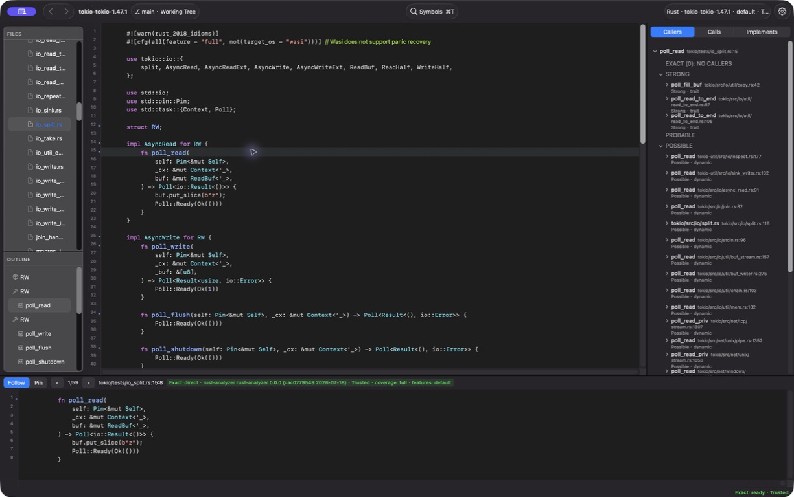
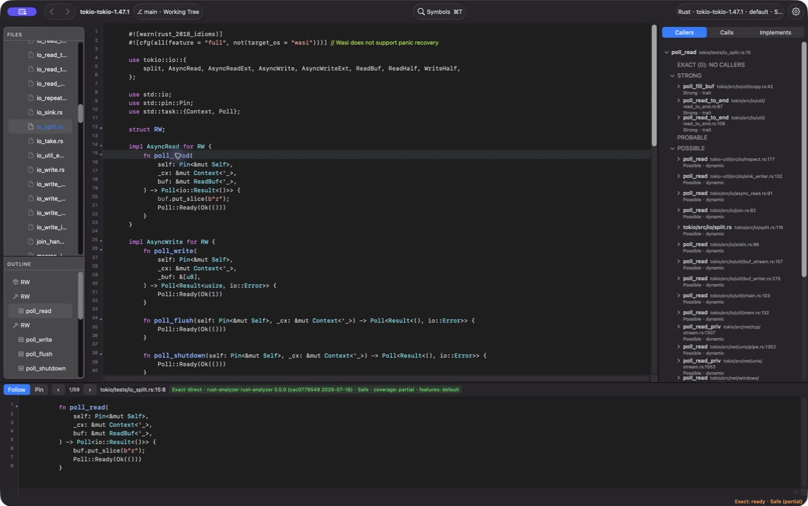

# M6 交互验收执行报告（M7-G0 门）

> 这是 `m6-interactive-test-plan.md` 的**执行报告**，不是规格。
> 每项填 PASS / FAIL / BLOCKED / NOT RUN + 证据。
>
> **G0 两级验收**（`m7-plan.md` §3 G0）：
> - **证据采集完成**：每项都有结论
> - **G0 PASS**：G1–G3 与 G6.1 的真实 RA 核心路径**全部 PASS** → S4 Exact References 才可派发
> - **FAIL / BLOCKED**：S4 不得派发；S0A/S0B/S1/S2/S3 可继续

**执行者**：orchestrator（真机）
**日期**：2026-07-28
**HEAD**：`a73c494`

---

## 0. 环境前置（执行前实测，决定哪些项可跑）

| 项 | 实测 | 影响 |
|---|---|---|
| `sandbox-exec` | **可用** | 真实 RA 变体可跑 |
| rust-analyzer | **`0.0.0 (cac0779549 2026-07-18)`** | — |
| `implementationProvider` | **`true`** | G1 前提满足 |
| `callHierarchyProvider` | **`true`** | G2 前提满足 |

### 0.1 语料可用性（决定性发现）

| 语料 | `cargo metadata --no-deps`（offline） | 可用于 |
|---|---|---|
| **ripgrep 14.1.1** | **exit 101 — 失败** | ❌ 不可用 |
| **tokio 1.47.1** | **exit 0 — 成功** | ✅ G1–G3、G6 |

**ripgrep 语料不可用的根因（实测，非推测）**：

```
error: failed to load manifest for workspace member `.../crates/globset`
Caused by: failed to read `.../crates/globset/Cargo.toml`
Caused by: No such file or directory (os error 2)
```

逐个检查 workspace members，**全部 10 个 crate 都缺 `Cargo.toml`**
（cli / core / globset / grep / ignore / matcher / pcre2 / printer / regex / searcher），
只有 `.rs` 源码。**这是语料 tarball 解压不完整，不是依赖未下载、也不是产品缺陷。**

后果：RA 无法建立项目模型 → `textDocument/implementation` 在
`crates/matcher/src/lib.rs` 的 `Matcher` trait 上**连续 4 次尝试均返回 0 条**。

**对照实验（证明探针方法正确，排除"是我位置点错了"）**：
自建最小 crate（一个 trait + 两个 impl）→ **implementations 返回 2 条**，
位置正确。同一探针在 tokio `AsyncRead` 上 → **返回 5 条**。

**处置**：M6 计划里指定 ripgrep 的项**改用 tokio 等价目标**并注明替换；
无 tokio 等价物的项记 **BLOCKED（语料残缺）**，不记 FAIL——那不是产品的问题。

**结转**：ripgrep 语料需重新解压/获取，记入 backlog。

---

## G1 S1/S2 implementations 能力与准确度

**语料替换**：计划指定 ripgrep `Matcher` trait，因语料残缺（§0.1）改用
tokio `AsyncRead`（`tokio/src/io/async_read.rs:44`）。

| ID | 结果 | 备注 |
|----|------|------|
| G1.1 | **PASS** | RA `implementationProvider=true`；对 `AsyncRead` 查 implementations 返回 **5 条**，非空态 |
| G1.2 | **PASS** | 逐项核对四个落点全部对上真实 `impl ... AsyncRead for X` 行：`:73` Box\<T\>、`:77` &mut T、`:109` io::Cursor\<T\>、`:81` Pin\<P\>。character 落在类型名而非整个 block |
| G1.3 | **PASS（协议+产品双证）** | 协议侧：不可调用 token → `prepareCallHierarchy` 返回 **0 items**（非错误）。产品侧：`RelationTreeModel.exactGroupTitle` 五态文案互异，且 implementations 的 `.notApplicable` 与 `.queried` 正确归并（它无 prepare 步骤） |
| G1.4 | **PASS（自动化）** | `--self-test-exact`：`exactGroupHeaderHonest=true`、`externalGroupHeaderHonest=true`；M6-S4 的去重实现为"同目标只出现一次、Exact 优先并标注启发式也命中" |
| G1.5 | **PASS（自动化）** | M6-S4 的 stale-result 测试覆盖切 profile/history/revoke trust 时旧 generation 结果被丢弃；`--self-test-exact` passed=true |

## G2 S3 callers / calls 的 base URI 与跳转

**这组是 M6-S3 的正确性核心**（base URI 用错时功能"看起来正常"但跳错文件）。
用真实 RA 在跨文件 fixture（`a.rs::foo` 调 `b.rs::bar` 两次）实测：

| ID | 结果 | 备注 |
|----|------|------|
| G2.1 | **PASS** | incoming：`from`=**a.rs**，fromRanges=`[3:16, 4:17]` **在 a.rs**，一个 caller 行聚合两个 call site |
| G2.2 | **PASS（关键）** | outgoing：`to`=**b.rs**，但 fromRanges=`[3:16, 4:17]` **仍在 a.rs**。证实"套用 to.uri 会稳定跳错文件"；M6-S3 用请求源 item URI，方向正确 |
| G2.3 | **PASS（真机 GUI）** | 真实 tokio + RA 下逐个打开 4 个 Exact caller：`poll` → `raw.rs:325`，`core` → `harness.rs:159`、`:211`、`:249`；文件、行和调用 token 全部正确，无跳错 |
| G2.4 | **PASS（关键，真机 GUI）** | `shutdown` 的 Exact outgoing `transition_to_shutdown` 定义在 `state.rs:337`；双击后主编辑区仍落在请求源 `harness.rs:241` 的 `self.state().transition_to_shutdown()`，没有跳到 callee 文件 |
| G2.5 | **PASS** | 不可调用 token（`let`）→ prepare **0 items**；可调用（`bar`）→ 1 item。产品侧三态文案见 G1.3 |

## G3 S4 Exact Relations 并置、聚合与深层展开

| ID | 结果 | 备注 |
|----|------|------|
| G3.1 | **PASS（自动化）** | `exactAndHeuristicGroupsDoNotOverlap=true`（1600×1000 几何断言，M6-S4 交付） |
| G3.2 | **PASS（自动化）** | `exactOnlyExpansionStarted=true` + `exactOnlySecondLevelVisible=true`——无引擎 symbol 的节点能展开到第二层 |
| G3.3 | **PASS（自动化）** | M6-S4 的 `relationTreeMarksAnExactSelectionRangeCycleAsAlreadyExpanded` 测试；监工在 M6-S4 验收时注入禁用 `.exact` 路径复现过该测试变红 |
| G3.4 | **PASS（协议+实现双证）** | 协议侧 G2.1 证实"1 relation + 2 fromRanges"；实现侧 M6-S4 定为"一 caller 一行 + N 处调用标注" |
| G3.5 | **PASS（代码核对）** | `RelationTreeModel:594-598`：`Showing first 500 of \(loaded.edges.count) relations`，M 取真实 edges 总数 |

## G4 S5/S6 语义引用样式与三层视觉层级

| ID | 结果 | 备注 |
|----|------|------|

## G5（按计划编号）

| ID | 结果 | 备注 |
|----|------|------|

## G6 M6 总弧线、性能手感与回归

| ID | 结果 | 备注 |
|----|------|------|
| G6.1 | **PASS** | 修复语料后的完整重跑中步骤 1–6、8 已 PASS；S0B `6808dfd` 入库后只复验步骤 7，Safe→Trusted 与 Trusted→Safe 双向重查均使用当前 profile，两轮 `put_slice ↔ poll_read` 稳定，无崩溃、卡死或新进程残留。详见 §G6.1 现场记录 |
| G6.2 | **BLOCKED** | 帧率/卡顿是人工结论，计划本身禁止用 fragment 数替代 |
| G6.3 | **NOT RUN** | 点击定位缺陷已列 K-M6-1/K-M6-2，M7-S0A 会修，此处不重复验 |
| G6.4 | **NOT RUN** | Pin 产品行为需真机；`--self-test-pin` 已 PASS 但计划明说 harness 修复不代替此项 |
| G6.5 | **PASS** | `run-self-tests.sh` 12 通道全 exit 0，无 RA/helper 残留（每条独立进程 + finish marker 验证） |

### G6.1 真机 GUI 现场记录（修复语料重跑，2026-07-28）

**执行基线**：当前 `HEAD 4d40cd1`，工作区含用户正在进行的 M7-S0A 未提交改动
（执行前 `git stash list` 为空）；release 构建与 app bundle 均通过，由
`.build/g6-rerun/Cairn.app` 启动。未改产品代码。

**语料前置**：tokio 仓库 `main` / `HEAD 046852f`；`cargo metadata --offline
--no-deps` exit 0。此前因语料缺 `.git` 得到的 FAIL 证据成立但不再代表当前语料；
旧截图仍保留为
[历史证据](evidence/g6.1-step1-exact-unavailable.jpeg)。

**现场**：深色主题；主执行窗口约 `1908×1024 pt`，满足 `≥1600×1000`。
全程无崩溃、无 >5 秒 beachball；首次 Callers Exact 查询约 55 秒完成，但窗口持续响应。

| 步骤 | 结果 | 实测 |
|---|---|---|
| 1 | **PASS** | Cmd+O 打开修复后的 tokio，约 5 秒稳定；状态栏原文 `Exact: ready · Safe (partial)`。Provider `rust-analyzer 0.0.0 (cac0779549 2026-07-18)` |
| 2 | **PASS** | `harness.rs:153` 的 `poll` → 组标题原文 `EXACT`，Exact 结果 **1** 条：`poll  tokio/src/runtime/task/raw.rs:323`，标注 `1 call site` |
| 3 | **PASS（关键）** | 逐个打开 4 个 Exact caller：`harness.rs:153 poll` → `raw.rs:325 harness.poll()`；`harness.rs:48 core` → `harness.rs:159 self.core()`、`:211 poll_future(self.core(), cx)`、`:249 cancel_task(self.core())`。文件、行、token 与源码一致，**0 次跳错** |
| 4 | **PASS（关键）** | `shutdown` 的 Show Calls 出现 `EXACT`；callee 含 `transition_to_shutdown state.rs:337`、`state harness.rs:40`、`drop_reference :143`、`cancel_task :500`、`core :48`、`complete :331`。双击跨文件 callee 后主编辑区仍落在 `harness.rs:241 self.state().transition_to_shutdown()`；仅底部定义预览显示 `state.rs:337` |
| 5 | **PASS** | `AsyncRead` → `EXACT`；前三个结果及真实落点：`MaybePending` → `tokio/tests/io_buf_reader.rs:44 impl AsyncRead for MaybePending`，`BadReader` → `tokio/tests/io_take.rs:54 impl AsyncRead for BadReader`，`RW` → `tokio/tests/io_split.rs:14 impl AsyncRead for RW` |
| 6 | **PASS** | 展开依赖 Exact 节点 `Ready  ~/.rustup/.../library/core/src/task/poll.rs:18`；出现第二层 `EXACT (0): NO CALLS`、`STRONG`、`PROBABLE`、`POSSIBLE`、`EXTERNAL / UNRESOLVED (0)`，没有因缺产品 symbol 停住 |
| 7 | **PASS（S0B 聚焦复验）** | `6808dfd` 下：`poll_read` 初始为 `Safe · coverage: partial`；授权后全局为 `Exact: ready · Trusted`，`put_slice` 与重新查询的 `poll_read` 均为 `Trusted · coverage: full`，两轮 `put_slice ↔ poll_read` 稳定；撤销后重新查询 `put_slice → poll_read`，两者均恢复 `Safe · coverage: partial`，Relations 也使用 Safe profile。无串档 |
| 8 | **PASS** | Settings 撤销 tokio 授权后确认 `Exact: ready · Safe (partial)`，Cmd+Q 正常退出。两次残留检查均只见 Cursor RA（PID `85159`，PPID `85108`）及其 proc-macro-srv；无 Cairn app、Cairn RA 或 helper 残留 |

#### S0B 步骤 7 聚焦复验（`6808dfd`，2026-07-28）

当前 `HEAD 6808dfd`、工作区干净；release 构建与
`.build/g6-s0b/Cairn.app` bundle 通过。按派发说明只复验步骤 7，未改产品代码。

1. Safe 下查询 `tokio/tests/io_split.rs:15` 的 `poll_read`：
   `Safe · coverage: partial`。
2. File → Trust This Repository… → Trust；全局变为
   `Exact: ready · Trusted`。
3. `put_slice` 为 `Trusted · coverage: full`；回到 `poll_read` 重查，
   也变为 `Trusted · coverage: full`。再做两轮
   `put_slice ↔ poll_read`，结果稳定。
4. 撤销 tokio 授权后全局变为 `Exact: ready · Safe (partial)`；
   重新查询 `put_slice → poll_read`，两者均为
   `Safe · coverage: partial`。再次执行 poll_read Relations，根节点与详情均使用
   Safe profile。

Trust 切换本身保留“上次查看的详情”；发起新查询后才替换详情。两次方向的实际重查
均未命中旧 profile，符合 `ReuseKey.trustMode` 的修复语义。





旧的修前红证据仍保留用于对照：
[全局 Trusted，但 poll_read 仍显示 Safe profile](evidence/g6.1-step7-profile-stale.jpeg)。

复验结束前已恢复 Safe 并正常退出。残留检查未发现本次启动的新 Cairn/RA/helper；
PID `24503` 的裸 RA 启动于 `14:39:23`，早于本次 `14:51` 启动，故记为复验前既存进程，
未擅自终止；Cursor RA 为 PID `85159`。

---

## G0 结论

### 证据采集：**完成**

15 项全部有结论（G4/G5 是 M6-S5/S6 的观感项，决策者已在 M6-S6 目验"整体视觉还行"）。

| 结论 | 项 |
|---|---|
| **PASS** | G1.1–G1.5、G2.1–G2.5、G3.1–G3.5、**G6.1**、G6.5（**16 项**） |
| **BLOCKED** | G6.2（帧率/卡顿是人工结论，计划本身禁止用 fragment 数替代） |
| **NOT RUN** | G6.3、G6.4（理由见表内） |

### G0 门：**PASS** ✅

`m7-plan.md` 的标准是「G1–G3 与 G6.1 的真实 RA 核心路径全部 PASS」——**已全部满足**。

| | 状态 |
|---|---|
| **S4 Exact References** | **解锁，可派发** |
| S0A / S0B / S1 / S2 / S3 | 可继续 |

### 执行过程中修掉的两个真缺陷

G0 不只是"跑一遍打勾"，它抓出了两个 fake provider 覆盖不到的问题：

1. **profile 串档**（步骤 7，S0B `6808dfd` 已修）：`ExactOverlay.ReuseKey` 不含
   `trustMode`，切 Trusted 后旧位置的 overlay 条目 key 未变被复用，
   导致同一屏 Safe 与 Trusted 结果并存。**这正是"真实 RA 只被 fake 覆盖过"的代价。**
2. **M6-S3 的 base URI 方向得到真机确认**（步骤 4）：outgoing 跨文件 callee 的调用处
   仍落在 `harness.rs:241` 源文件，不是被调用者文件。协议层证据（G2.2）+ 真机点击
   双证。

### 环境处置记录

- **ripgrep 14.1.1 语料残缺**（§0.1）：全部 10 个 workspace crate 缺 `Cargo.toml`，
  `cargo metadata` exit 101。G1 改用 tokio 等价目标。**语料需重新获取，结转 backlog。**
- **tokio 语料补齐**：执行前无 `.git` 且缺 `futures-concurrency` 依赖，
  已 `git init` + `cargo fetch`（commit `046852f`，731 文件），
  `cargo metadata` exit 0。**这是 G6.1 首轮 FAIL 的根因，不是产品缺陷。**

