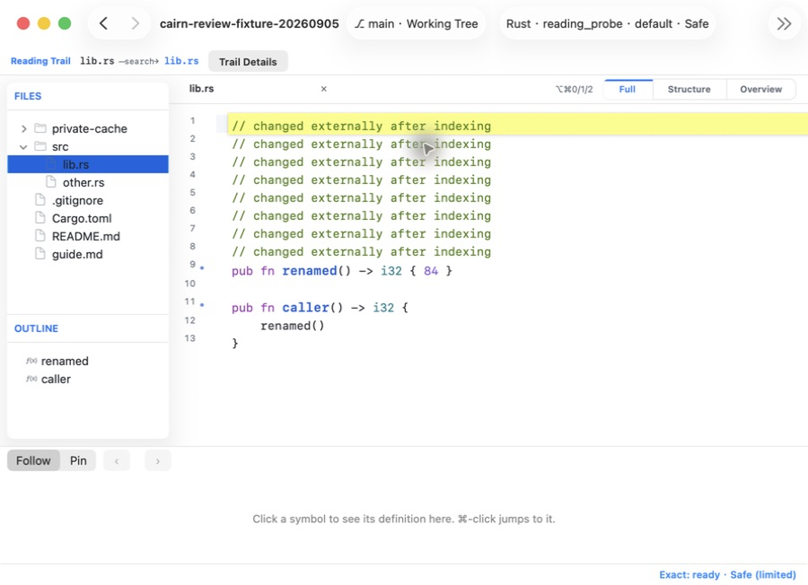
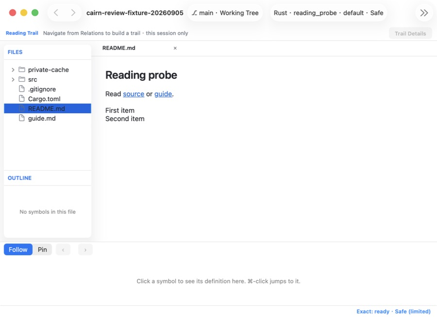
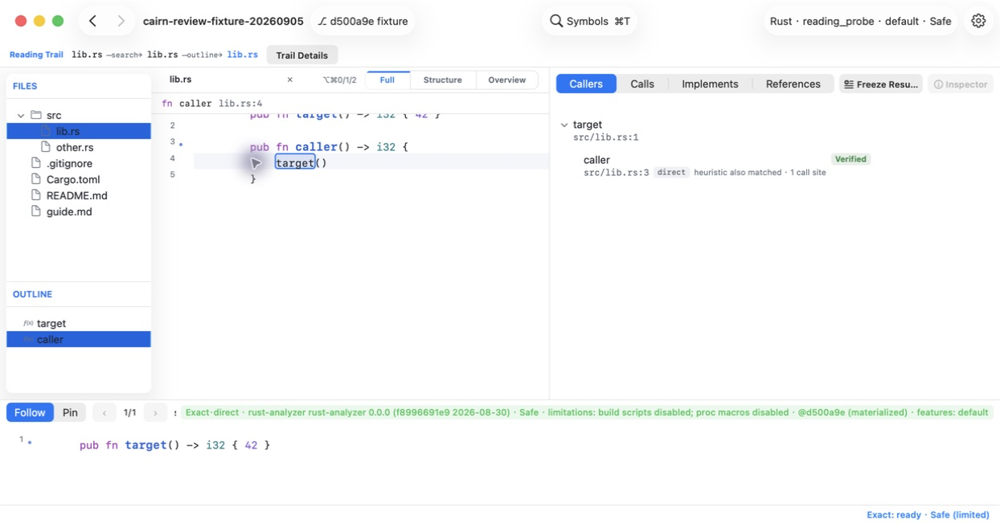
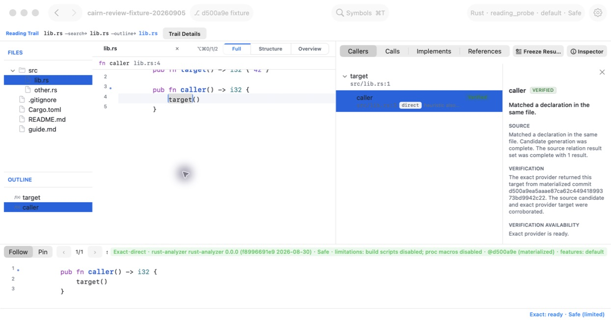

# Cairn 需求、架构与产品体验审查

审查日期：2026-09-05。源码基线：`ac18460`。本次审查未修改项目源码或提交；按用户要求新增本审查记录。原有未跟踪 `.claude-trace/` 未触碰。

**结论：产品方向和主体分层与目标基本一致，但“空闲时轻量”和“导航结果可信”已有真实失败。应先修生命周期和内容一致性，再继续扩展功能。没有理由重写整个架构。**

## 我理解的目标

依据当前 README、总设计和后续里程碑，Cairn 要帮助工程师在本机安全理解陌生仓库：无需构建即可阅读和得到候选；Context 用于不打断主阅读的预览；Relations 用于探索源码关系；历史版本通过虚拟快照读取；所有结果明确其来源、覆盖范围和不确定性。只读、离线和不修改仓库是核心约束。

阅读成果分为三类，边界有实际用途：Reading Trail 记录会话中的探索路径；Reading Set 保存冻结源码与证据；书签和笔记保存长期锚点。无需再引入统一“知识实体”、插件框架或通用工作流引擎。

M14 增加 README、HTML、图片和 PDF 阅读，符合理解整个仓库的场景。局部采用 WebKit 不代表整个应用架构偏离原生；应更新总设计中“无 WebView”的绝对表述。

## 需要先处理的问题

### 1. P1：LSP 结束后仍空转，实测约占两个 CPU 核心

**状态：真实进程复现，源码定位完成，未修复。**

`/Applications/Cairn.app/Contents/MacOS/codeinsight-app`，PID 27765，两次进程观测为 198.7% 和 175.1% CPU。此时本次 Release 编译和首轮聚焦测试已经结束；隔离的新应用空窗口为 0%。因此不能把持续高占用归因于构建。

3 秒 `sample` 中主线程在正常等待事件，两个 `com.apple.NSFileHandle.fd_monitoring` 队列反复执行 `LSPClient.installHandlers()` 的 stdout/stderr 回调、`availableData`、`read` 和空 NSData 分配。

当前源码的 stdout 在空数据时只设置 `reachedEOF` 并唤醒条件变量；stderr 在空数据时直接返回。两者都没有在 EOF 时注销 readabilityHandler，清理仅发生于 close/deinit。这解释了连接不再产出结果后仍持续消耗 CPU 的现象。准确的 provider 退出原因尚未追溯，不影响对当前空转位置的定位。

最小修正方向：在各自流的 EOF 上停止相应监听，并核对 EOF、进程终止、显式 close 和等待请求的结束顺序。补一条“关闭 provider 输出后 CPU/回调次数不再增长”的真实管道回归验证，而不是只验证请求报错。

证据：[LSP.swift:661](/Users/siancao/work/ai/vibecoding/codeinsight/Sources/CodeInsightExact/LSP.swift:661)；[3 秒进程采样](evidence/2026-09-05/high-cpu.sample.txt)。

### 2. P1：显示新源码，却使用旧索引的 offset 导航

**状态：当前源码构建的原生应用已复现，未修复。**

复现步骤：

1. 打开临时 Rust 仓库，原文件第 1 行为 `pub fn target() -> i32 { 42 }`，完成索引。
2. 在应用之外只修改临时 fixture：前插 8 行注释，将 `target` 改为 `renamed`。
3. 切到 other.rs 再切回来；Reader 和 Outline 正确显示 `renamed`。
4. `⌘T` 搜索 `#target`，仍返回 `target src/lib.rs:1:8`。
5. 按 Enter，主区高亮第 1 行注释；没有内容已变化或索引已过期提示。

根因链：WorktreeSnapshot 和 EngineSession 持有捕获内容；worktree 的 `documentSource` 却设为 nil，Reader 重新打开文件时读取当前磁盘。文件内容变化未推进 snapshot/generation，旧查询仍被视为当前查询。generation 可以防止旧异步任务跨会话发布，却不能单独保证磁盘字节与查询字节一致。Context 的文档加载同样没有核对加载结果和所请求 contentID。

最小修正方向：明确 worktree 阅读合同。如果阅读的是捕获快照，Reader、Context、搜索和跳转统一使用捕获 bytes；如果要显示 live 磁盘内容，则遇到 contentID 不一致时停止使用旧 offset，并给出刷新入口，刷新完成后再恢复语义操作。不要先引入跨版本符号映射或新导航框架。

证据：[AppModel.swift:2619](/Users/siancao/work/ai/vibecoding/codeinsight/Sources/CodeInsightAppModel/AppModel.swift:2619)、[Reader display:5856](/Users/siancao/work/ai/vibecoding/codeinsight/Sources/CodeInsightApp/MainWindowController.swift:5856)、[ContextWindowModel.swift:793](/Users/siancao/work/ai/vibecoding/codeinsight/Sources/CodeInsightAppModel/ContextWindowModel.swift:793)。

### 3. P1 架构风险：全文件捕获与无界内存存储叠加

**状态：代码路径确认；未给出大型仓库性能达标或不达标结论。**

WorktreeSnapshot 初始化会读取、哈希并保留所有允许文件的 `[UInt8]`，CommitSnapshot 也在初始化阶段读取全部 blob。混合语言导入和版本切换在捕获完成后才发布 firstPaint。

`ProjectIndexer.prepareSnapshot` 在判断是否源码之前就把每个文件的 bytes 放入 capturedBytes，随后插入 `ProjectIndexStore`。该 store 在 ProjectIndexService 中长期持有，只有 insert，没有内存预算、移除或项目切换时重建。磁盘 IndexCache 的淘汰并不能回收这份内存。

因此大型 PDF、图片、数据文件即使没有打开，也会进入启动工作量和长寿命存储；反复读不同项目、不同版本的新内容还会积累。这里的问题是对象寿命与产品使用时长不匹配，不是 Swift 模块数量过多。没有把数组写入多个字典简单等同于立即复制多份物理内存。

最小方向：先区分首屏需要的目录信息、语义查询需要的源码 bytes 和按需预览内容；明确项目关闭/切换时的存储释放边界，给捕获内容设真实预算。历史 blob 可按对象 ID 按需读取；worktree 如需不可变则必须有受预算约束的捕获策略，不能用 live 磁盘读取冒充冻结。

证据：[GitSnapshot.swift:311](/Users/siancao/work/ai/vibecoding/codeinsight/Sources/CodeInsightGit/GitSnapshot.swift:311)、[ProjectIndexer.swift:241](/Users/siancao/work/ai/vibecoding/codeinsight/Sources/CodeInsightEngine/ProjectIndexer.swift:241)、[ProjectIndexStore.swift:5](/Users/siancao/work/ai/vibecoding/codeinsight/Sources/CodeInsightEngine/ProjectIndexStore.swift:5)、[ProjectIndexService:144](/Users/siancao/work/ai/vibecoding/codeinsight/Sources/CodeInsightAppModel/AppModel.swift:144)。

### 4. P2：单语言和混合语言维护两套打开流程

单语言经 `openProject(root:language:)`，先建立目录树，再一次性 index，最终发布 fullReady；多语言经 `openProject(root:languages:)`，捕获快照后分 firstPaint、cachedReady、fullReady。两条流程重复负责取消、generation、书签、Exact、历史、Trail、tabs 和失败状态。

不同语言数量导致启动阶段和错误路径不同，也意味着每加一项会话状态需要记得同步两个入口。应在现有 AppModel 内收敛共同的初始化和发布流程，语言选择保留为数据；不需要新建协调器框架。普通非 Git 目录仍需保留既有单语言 fallback 的能力。

证据：[MainWindowController.swift:556](/Users/siancao/work/ai/vibecoding/codeinsight/Sources/CodeInsightApp/MainWindowController.swift:556)、[AppModel.swift:797](/Users/siancao/work/ai/vibecoding/codeinsight/Sources/CodeInsightAppModel/AppModel.swift:797)、[AppModel.swift:1229](/Users/siancao/work/ai/vibecoding/codeinsight/Sources/CodeInsightAppModel/AppModel.swift:1229)。

### 5. P2：打开失败后没有足够信息恢复

项目打开 catch 丢弃具体 error，落为 `.failed`；空态只显示 “Couldn't open this folder.” 和 “Try Again”。权限、Git 仓库形态、配置和提取失败等原因无法区分。反复 Try Again 不会解决确定性错误。

最小方向：保留底层错误，在现有失败面显示简短原因和对应操作。沿用已有错误类型即可，不需要再造全局错误平台。

证据：[AppModel.swift:909](/Users/siancao/work/ai/vibecoding/codeinsight/Sources/CodeInsightAppModel/AppModel.swift:909)、[EmptyStateView.swift:105](/Users/siancao/work/ai/vibecoding/codeinsight/Sources/CodeInsightApp/EmptyStateView.swift:105)。本项为源码检查，未在真实窗口逐类注入失败。

### 6. P2：关系命令的目标依赖 Context，影响键盘与 Pin 的独立性

实际从 Outline 定位函数，或选中调用符号后，Show Callers/Calls/Implementations 仍禁用；真正单击源码符号、使 Context 产生候选后才可用。

菜单验证只检查 `contextWindow.selectedCandidate != nil`，执行又从该候选取 symbol；Reader 当前选区不参与。这是 UI 层的目标归属耦合。进一步推断：如果 Context 被 Pin 固定，主 Reader 已移到别处，全局 Relations 命令仍可能查询固定的旧目标；本次没有把这一 Pin 分支声称为已实测。

建议全局关系命令复用已有右键动作的“按当前 Reader 文件与 offset 解析目标”路径，Pin 继续仅控制底部预览。证据：[菜单验证:9666](/Users/siancao/work/ai/vibecoding/codeinsight/Sources/CodeInsightApp/CodeInsightApp.swift:9666)、[命令实现:1643](/Users/siancao/work/ai/vibecoding/codeinsight/Sources/CodeInsightApp/MainWindowController.swift:1643)。

### 7. P2：Exact 的长来源说明干扰阅读布局

本次没有手动改变窗口尺寸，但首次显示完整 Exact Context 后，截图尺寸从 900×652 增至 1244×652；底部来源 badge 占据几乎整条工具栏，路径文字被严重挤压。上方 Relations 把来源浓缩为 Verified，而底部一次显示 provider、版本、trust、limitations、commit 和 features，信息层级不一致。

`candidateLabel` 直接展示完整 provenance，其水平压缩优先级未像 pathLabel 一样降低，外层横向 NSStackView 两端固定。这是应重点验证的约束路径；尚未通过约束日志或单变量实验锁定扩窗的唯一原因。

最小方向：底部用简短来源状态，完整环境放现有 tooltip/Inspector；明确标签宽度与压缩策略，并补“长 provider 文本出现前后窗口尺寸不变”的运行验证。证据：[Context header:6262](/Users/siancao/work/ai/vibecoding/codeinsight/Sources/CodeInsightApp/MainWindowController.swift:6262)、[candidate label:6410](/Users/siancao/work/ai/vibecoding/codeinsight/Sources/CodeInsightApp/MainWindowController.swift:6410)。

## UI 与交互是否支持目标

本次当前 bundle 的实际流程：

| 步骤 | 实际操作 | 判断 |
|---|---|---|
| 1 | 启动空窗口 | 主打开按钮清楚；未打开项目就出现 Trail、Reading Height、Context 等次要区域，信息偏多 |
| 2 | Open Project → NSOpenPanel | 原生文件选择可用 |
| 3 | Choose Languages | 功能可用，但三个选项都不预选，Open 初始禁用；与“零配置导入”存在体验张力 |
| 4 | 选择 README.md | Markdown 只读预览可用；无用的 Outline 空态和底部 Context 仍占空间 |
| 5 | 点击 README 中 source 链接 | 正确进入 lib.rs，文件树、tab 和源码控件恢复，Back 变为可用 |
| 6 | 外部修改 → 重开文件 → 搜索旧符号 → Enter | FAIL：Reader 新内容与旧语义索引混用，跳到注释 |
| 7 | 版本列表 Down/Enter → 原始 commit | PASS：显示旧源码，磁盘修改仍在；鼠标行激活本次未得到稳定证据 |
| 8 | 单击调用符号 → Context → Show Callers | PASS：显示定义及 Verified caller；仅选择文字时命令禁用 |
| 9 | 选择 caller → Inspector | PASS：来源依据、验证结论、历史 commit 和 Safe 限制可读 |
| 10 | Trail Details | AX 确认 search/outline 和 snapshot boundary；弹出层截图因捕获裁切未采用 |
| 11 | Freeze Results → 重启 | BLOCKED：持久化动作被自动审批拒绝，本轮未执行 |

优先调整不是重做配色：

- 阅读非源码时按内容收起不适用的 Context/Outline，并保留用户回到源码时的布局。
- 导入时根据已有语言分类能力提供合理预选，允许修改，降低重复确认成本。这是对既有明确语言选择设计的改进建议，不将原计划的实现说成违规。
- 当前 fixture 的短 Markdown 列表丢失项目符号，只剩两行普通文本；应保留列表层级。基础标题、链接与正文间距已经可用。
- 在 900pt 宽、较长项目名时 Symbols 进入 toolbar overflow。可限制项目标题占宽，让核心搜索入口保持可见；快捷键仍有效。
- Trail、Reading Set、Bookmark 的定位合理，但需要在入口处说清“会话路径 / 冻结证据 / 长期锚点”，不能仅靠 README 教会用户。

辅助功能：本次 AX 能读到明确的 Markdown preview、文件树选择、链接、阅读高度和 provider 限制。没有完成 VoiceOver、全键盘遍历、对比度和所有主题检查，因此不宣称无障碍全面通过。

### 实际跑通的历史版本与关系证据

在临时仓库里通过版本列表的 Down/Enter 切到 `d500a9e`，Reader 恢复 commit 中的 `target`；磁盘仍保持已修改的 `renamed`，`git status --short` 仍是 ` M src/lib.rs`。本次验证了该路径的虚拟版本切换，没有执行 checkout。

实际单击源码调用点后，Context 展示 rust-analyzer 的 Exact 结果；Show Callers 返回一个 caller，标记 Verified；选择结果后 Inspector 展示 same-file 源码依据、exact corroboration、物化 commit 完整 SHA 和 Safe 限制。这个流程的结果来源表达与核心目标一致。

### Trail / Reading Set 的产品取舍

Trail 通过 AX 确认记录 search、outline 和 worktree→commit 边界，并区分导航时证据与当前证据；没有关系解释的节点，Freeze Path 禁用。弹出层截图左侧被捕获窗口边界截掉，因此不把截图裁切作为产品布局缺陷证据。

启动提示只说“Navigate from Relations”，与 search/outline 也进入 Trail 不完全一致；可改为更宽泛的“Follow symbols to build a trail”。“explanation store”是实现术语，可直接改成“Current evidence”。

源码确认冻结文本/证据进入既有 tagged session codec，文件按原子方式写入；每个 Reading Set 至多 50 段。但它的寿命仍受 tabs 控制：默认最多 10 个 tab，LRU 淘汰不区分文件与 Reading Set。这符合 M11 “与文件 tab 一样受 tab 生命周期管理”的明确裁决，不记为实现违规；产品不能让用户误认为独立永久保存的资料库。可先明确文案与丢失边界，不必新建 Reading Set 数据库。

证据：[M11 生命周期裁决:149](/Users/siancao/work/ai/vibecoding/codeinsight/docs/plans/m11-plan.md:149)、[TabStripModel.swift:117](/Users/siancao/work/ai/vibecoding/codeinsight/Sources/CodeInsightAppModel/TabStripModel.swift:117)、[session 编码:748](/Users/siancao/work/ai/vibecoding/codeinsight/Sources/CodeInsightAppModel/AppModel.swift:748)。

## 架构中值得保留的部分

实际主链是：AppKit 事件 → AppModel 导航/会话状态 → EngineSession 和 QueryContext → 内容索引/候选解析 → Context 与 Relations 呈现；ExactCoordinator 负责外部语言服务增强。Git、ReaderCore 和 ReaderUI 各自有独立职责。

- 内容事实与 snapshot/profile 分离，使跨版本复用和环境差异有合理表达。
- EngineSession 对 snapshot/profile/generation 的验证有价值，应补上字节一致性而不是取消这套约束。
- Rust/Python/TypeScript 的实际提取与 provider 对应真实消费者，现有抽象并非纯粹为将来预留。
- 原生 NSTextView、PDFKit 和隔离 WebKit 已覆盖预览用途，不需要 renderer registry。
- Safe Mode 的受控进程、网络限制、禁用 build scripts/proc macros，以及 HTML 的 CSP/导航限制，有实现依据；本次未执行完整安全测试，不将其视为全部认证通过。
- 单层 Relations 结果加换根导航、会话 Trail、冻结 Reading Set 是已有裁决。没有证据要求恢复深递归树或新增知识管理层。

代码体量值得整理，但不要按行数直接判架构失败。`CodeInsightApp.swift` 11,987 行，大量是内嵌产品自测；`MainWindowController.swift` 6,489 行，内含多个 controller、预览分发和测试接口；`AppModel.swift` 3,236 行。最有收益的整理是把已有测试/已有类移到合适文件，并统一重复状态转换，不是为拆文件新增 domain types。

## 需求文档需统一的地方

- 总设计仍写 M10/M11 真实闭环 BLOCKED，而 README 和后续验收记录写已可用。历史通过记录不等同于本次重验，但当前状态文字应一致。
- 总设计写“无 WebView”，M14 已明确批准局部 WKWebView 预览。
- 总设计 F4.5 要求 worktree 未跟踪文件遵循 `.gitignore`，M14 明确采用固定跳过目录之外的全部常规文件。本次 CLI 快照和 GUI 文件树均包含 `private-cache/ignored.rs`。这是现行需求冲突，不能不核对后续裁决就称 M14 漏实现。
- P1 中 SCIP、符号 lineage、结构化搜索等仍混在总需求里。README 未承诺这些已交付；应标清当前支持、批准延期和远期构想，避免把一个蓝图当成当前验收清单。

## 验证边界与建议次序

当前源码 Release bundle 构建与签名验证通过；本次确实操作了独立 bundle 的打开、语言选择、Markdown、源码链接、重新加载、符号搜索、commit 切换、Context、Relations、Inspector 和 Trail Details。此前已安装应用的截图未作为当前 M14 外观证据。

当前源码重建后的聚焦测试为 36/36 PASS（6.901 秒），覆盖 Git snapshot、session restore 和 non-source preview。未运行完整 CI、全部真实 provider、完整 Trail → Reading Set → 重启、Git 多版本全流程或大型仓库性能门禁。历史 851 tests 的记录不作为本次全量通过结论。

建议顺序：LSP EOF 空转 → Reader/语义内容一致性 → 捕获内容寿命与预算 → 关系命令目标/打开流程/错误反馈 → 稳定布局与首次导入 → 统一需求文档。每项独立复现、独立修复、独立验收。

高 CPU 已安装 Cairn 的退出操作被自动审批拒绝，因其可能承载用户原有会话；随后用户要求记录问题、继续分析。本次保持该实例运行，不再尝试退出。

本轮 Freeze Results 实际点击被自动审批拒绝，因为它会创建并持久化 Reading Set。本次未创建该数据，也未绕过限制；保存→重启完整产品闭环明确标为本轮未实测。

[当前源码聚焦测试日志](evidence/2026-09-05/focused-tests.log)
